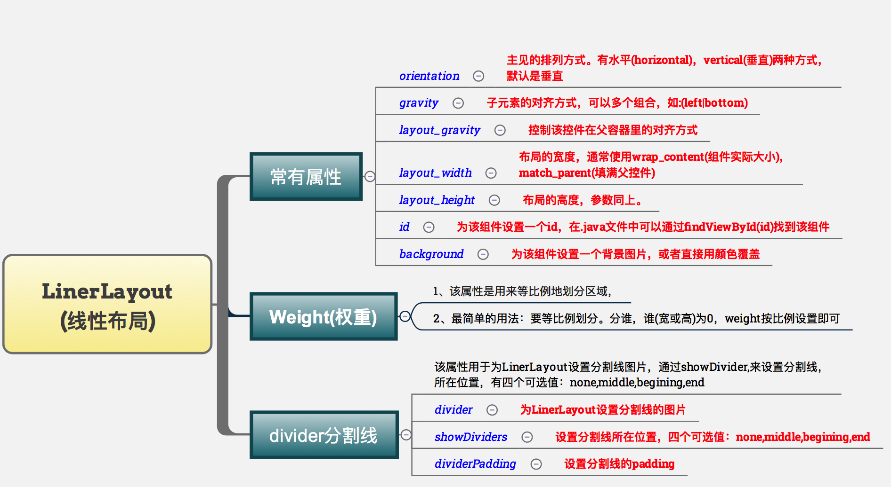
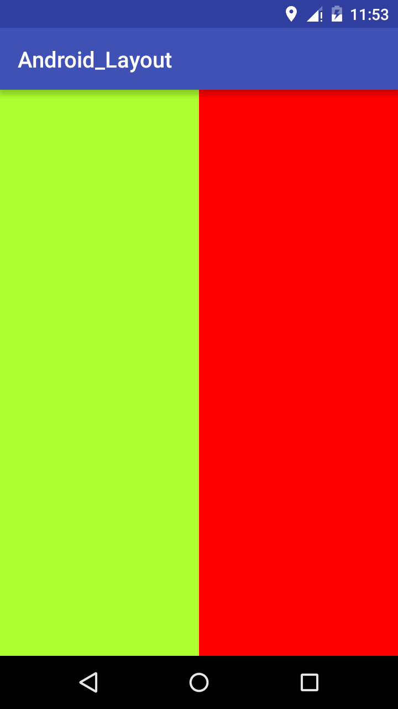
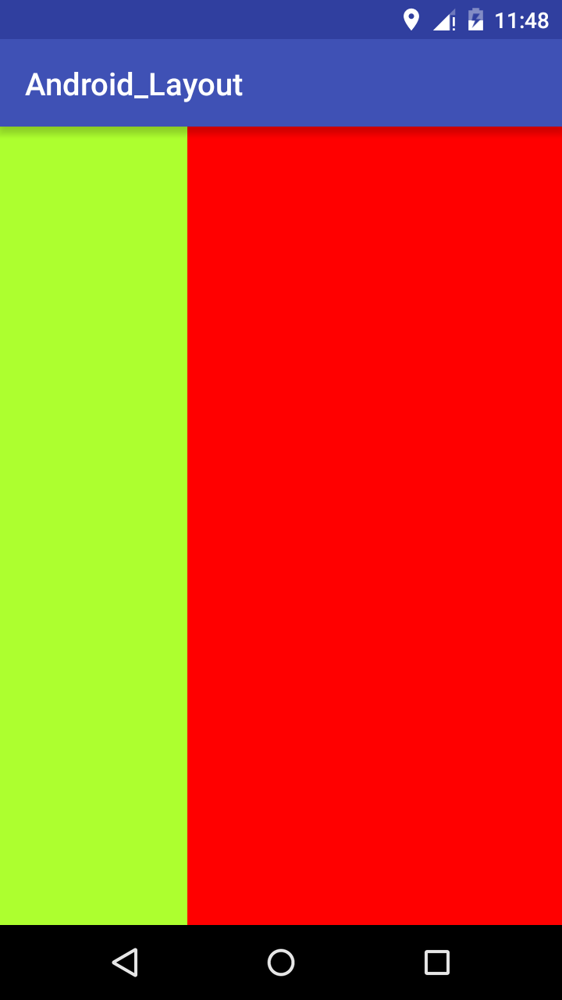
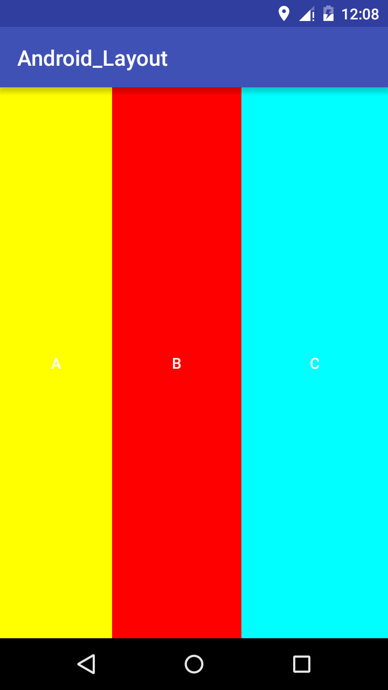
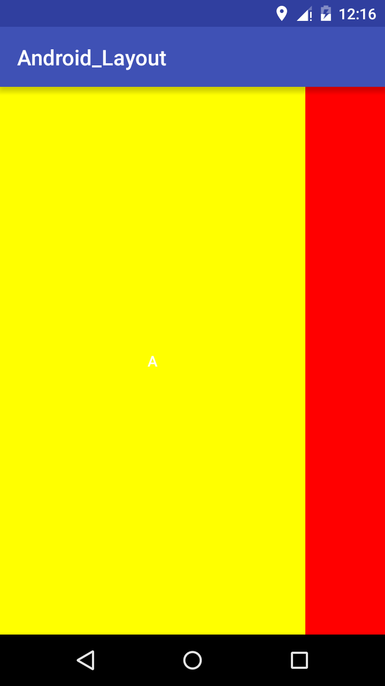
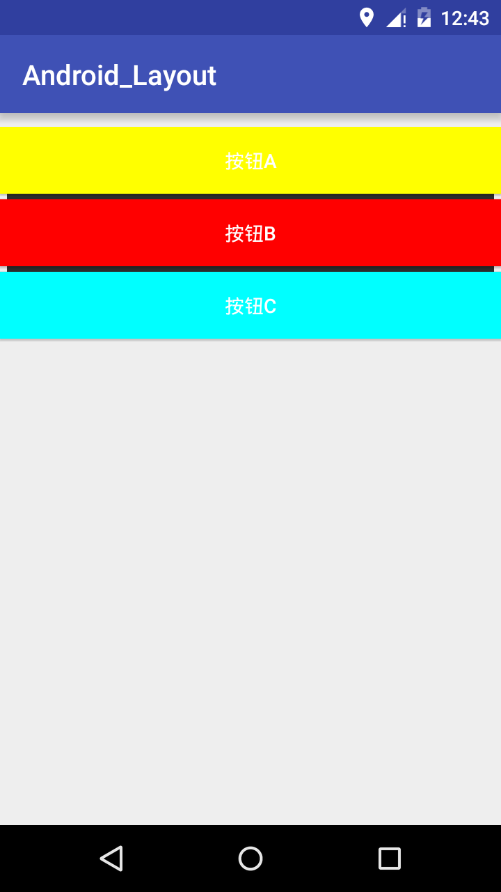
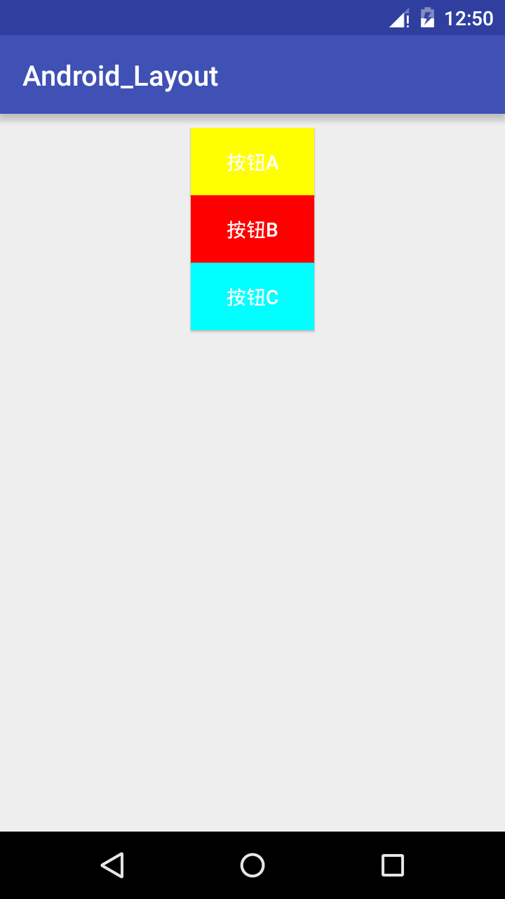

##一、LinearLayout(线性布局)


### weight(权重)属性详解
#### 1. weight简单使用
代码实现，先看看效果图：


```java

<?xml version="1.0" encoding="utf-8"?>
<LinearLayout xmlns:android="http://schemas.android.com/apk/res/android"
    xmlns:tools="http://schemas.android.com/tools"
    android:layout_width="match_parent"
    android:layout_height="match_parent"
    android:orientation="horizontal">

    <LinearLayout
        android:layout_width="0dp"
        android:layout_height="match_parent"
        android:background="#ADFF2F"
        android:layout_weight="1"/>

    <LinearLayout
        android:layout_width="0dp"
        android:layout_height="match_parent"
        android:background="#f00"
        android:layout_weight="2"/>

</LinearLayout>
```
使用步骤：

	1. 将android:width属性设置为0dp
	2. 把android:layout_weight属性设置比例即可，如上图
	3. 竖直方向,只需设android:height为0dp,然后设weight属性
	
#### weight属性深入
当不适用设置0dp的时候,而是直接用wrap_content和match_parent的话，此时分为两种情况：wrap_content与match_parent，同时要注意LinearLayout的orientation属性
1. wrap_content直接设置比例即可
```java
<?xml version="1.0" encoding="utf-8"?>
<LinearLayout xmlns:android="http://schemas.android.com/apk/res/android"
    xmlns:tools="http://schemas.android.com/tools"
    android:layout_width="match_parent"
    android:layout_height="match_parent"
    android:orientation="horizontal">

    <Button
        android:text="A"
        android:textColor="#fff"
        android:layout_width="wrap_content"
        android:layout_height="match_parent"
        android:background="#ff0"
        android:layout_weight="1"/>

    <Button
        android:text="B"
        android:textColor="#fff"
        android:layout_width="wrap_content"
        android:layout_height="match_parent"
        android:background="#f00"
        android:layout_weight="2"/>

    <Button
        android:text="C"
        android:textColor="#fff"
        android:layout_height="match_parent"
        android:layout_width="wrap_content"
        android:background="#0ff"
        android:layout_weight="3"
        />

</LinearLayout>
```
运行效果如下：


2. match_parent则需要计算了
```java
<?xml version="1.0" encoding="utf-8"?>
<LinearLayout xmlns:android="http://schemas.android.com/apk/res/android"
    xmlns:tools="http://schemas.android.com/tools"
    android:layout_width="match_parent"
    android:layout_height="match_parent"
    android:orientation="horizontal">

    <Button
        android:text="A"
        android:textColor="#fff"
        android:layout_width="match_parent"
        android:layout_height="match_parent"
        android:background="#ff0"
        android:layout_weight="1"/>

    <Button
        android:text="B"
        android:textColor="#fff"
        android:layout_width="match_parent"
        android:layout_height="match_parent"
        android:background="#f00"
        android:layout_weight="2"/>

    <Button
        android:text="C"
        android:textColor="#fff"
        android:layout_height="match_parent"
        android:layout_width="wrap_content"
        android:background="#0ff"
        android:layout_weight="3"
        />

</LinearLayout>
```

运行效果如下：

当我们把`android:layout_height`改为`match_parent`时出现了问题，C区域不见了？网上找到的解释：

	1. 个个都是fill_parent,但是屏幕只有一个啦,那么1 - 3 = - 2 fill_parent step 2:依次比例是1/6,2/6,3/6 step 
	2. 先到先得,先分给one,计算: 1 - 2 * (1/6) = 2/3 fill_parent 接着到two,计算: 1 - 2 * (2/6) = 1/3 fill_parent 
	3. 计算 1 - 2 * (3/6) = 0 fill_parent step 4:所以最后的结果是:one占了两份,two占了一份,three什么都木有

### 设置分割线
分割线的两种做法：
1. 直接在布局中添加一个显示出一条线view,
```java

    <View
        android:layout_width="match_parent"
        android:layout_height="1px"
        android:background="#000000" />
```
2. 使用LinearLayout的一个divider属性，为LinearLayout设置分割线，此时需要一张图片，代码如下：
```java
<?xml version="1.0" encoding="utf-8"?>
<LinearLayout xmlns:android="http://schemas.android.com/apk/res/android"
    xmlns:tools="http://schemas.android.com/tools"
    android:layout_width="match_parent"
    android:layout_height="match_parent"
    android:layout_marginTop="10dp"
    android:divider="@drawable/divider_line"
    android:showDividers="middle"
    android:dividerPadding="5dp"
    android:orientation="vertical">

    <Button
        android:text="按钮A"
        android:textColor="#fff"
        android:layout_width="match_parent"
        android:layout_height="wrap_content"
        android:background="#ff0"/>

    <Button
        android:text="按钮B"
        android:textColor="#fff"
        android:layout_width="match_parent"
        android:layout_height="wrap_content"
        android:background="#f00"/>

    <Button
        android:text="按钮C"
        android:textColor="#fff"
        android:layout_height="wrap_content"
        android:layout_width="match_parent"
        android:background="#0ff"
        />
</LinearLayout>
```
实现效果如下:


### gravity的使用
```java
<?xml version="1.0" encoding="utf-8"?>
<LinearLayout xmlns:android="http://schemas.android.com/apk/res/android"
    xmlns:tools="http://schemas.android.com/tools"
    android:layout_width="match_parent"
    android:layout_height="match_parent"
    android:layout_marginTop="10dp"
    android:gravity="center_horizontal"
    android:orientation="vertical">

    <Button
        android:text="按钮A"
        android:textColor="#fff"
        android:layout_width="wrap_content"
        android:layout_height="wrap_content"
        android:background="#ff0"/>

    <Button
        android:text="按钮B"
        android:textColor="#fff"
        android:layout_width="wrap_content"
        android:layout_height="wrap_content"
        android:background="#f00"/>

    <Button
        android:text="按钮C"
        android:textColor="#fff"
        android:layout_height="wrap_content"
        android:layout_width="wrap_content"
        android:background="#0ff"
        />
</LinearLayout>
```
运行效果如下：

