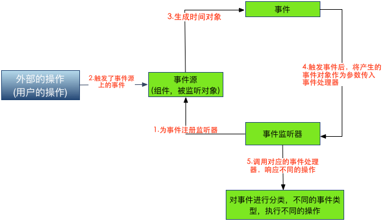
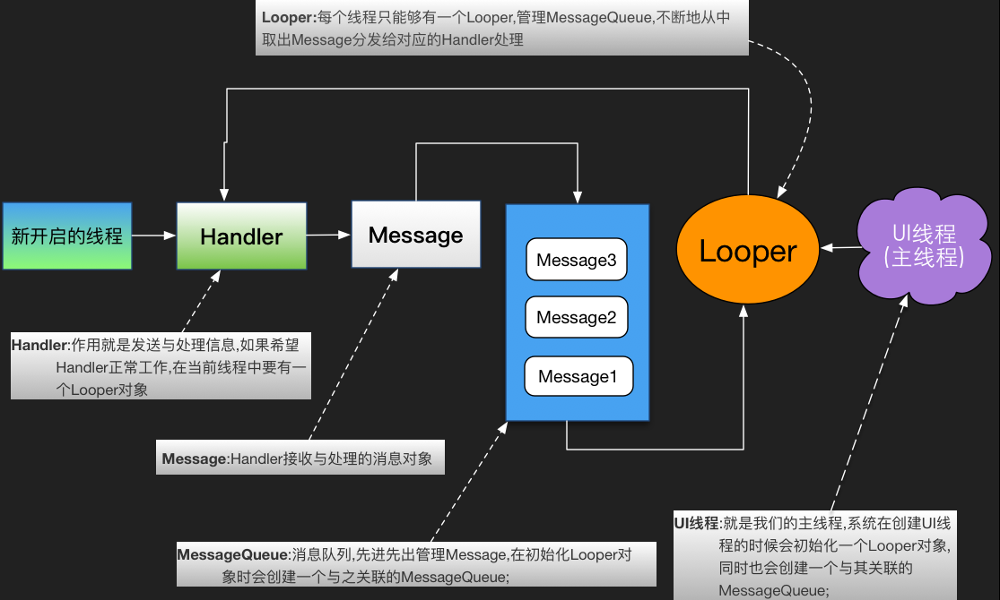
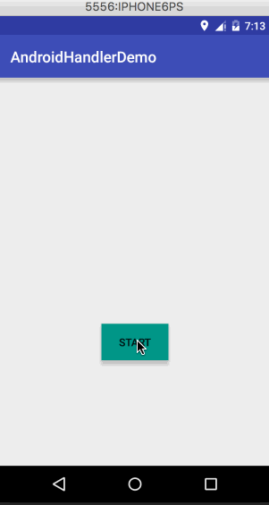

### Android事件的处理

#### 基于监听的事件处理

事件监听机制中由事件源，事件，事件监听 器三类对象组成 处理流程如下:

 	1.为某个事件源(组件)设置一个监听器,用于监听用户操作 
 	2.用户的操作,触发了事件源的监听器
 	3.生成了对应的事件对象 
 	4.将这个事件源对象作为参数传给事件监听器 
 	5.事件监听器对事件对象进行判断,执行对应的事件处理器(对应事件的处理方法)
总结：事件监听机制是一种委派式的事件处理机制,事件源(组件)事件处理委托给事件监听器 当事件源发生指定事件时,就通知指定事件监听器,执行相应的操作
实例：[Android按钮点击的几种写法](https://github.com/wangdongyang/AndroidEveryDay/blob/master/Android%E6%8C%89%E9%92%AE%E7%82%B9%E5%87%BB%E7%9A%84%E5%87%A0%E7%A7%8D%E5%86%99%E6%B3%95.md)

#### 基于回调的事件处理
关于方法回调：是将功能定义与功能分开的一种手段,一种解耦合的设计思想;在Java中回调是通过接口来实现的, 作为一种系统架构,必须要有自己的运行环境,且需要为用户提供实现接口;实现依赖于客户,这样就可以 达到接口统一,实现不同,系统通过在不同的状态下"回调"我们的实现类,从而达到接口和实现的分离！

Android回调的事件处理机制使用场景：通常用法:继承基本的GUI组件,重写该组件的事件处理方法,即自定义view 注意:在xml布局中使用自定义的view时,需要使用"全限定类名"：
自定义view：
	
	①在该组件上触发屏幕事件: boolean onTouchEvent(MotionEvent event);
	②在该组件上按下某个按钮时: boolean onKeyDown(int keyCode,KeyEvent event);
	③松开组件上的某个按钮时: boolean onKeyUp(int keyCode,KeyEvent event);
	④长按组件某个按钮时: boolean onKeyLongPress(int keyCode,KeyEvent event);
	⑤键盘快捷键事件发生: boolean onKeyShortcut(int keyCode,KeyEvent event);
	⑥在组件上触发轨迹球屏事件: boolean onTrackballEvent(MotionEvent event);
	⑦当组件的焦点发生改变,和前面的6个不同,这个方法只能够在View中重写哦！ protected void onFocusChanged(boolean gainFocus, int direction, Rect previously FocusedRect)
代码实现的话，后面会慢慢在很多的地方接触到，

#### 响应系统设置的事件(Configuration类)
Configuration类是用来描述手机设备的配置信息的，比如屏幕方向， 触摸屏的触摸方式等，在: frameworks/base/core/java/android/content/res/Configuration.java 找到这个类，然后改下相关设置，比如调整默认字体的大小！
Configuration提供的方法列表：

	densityDpi：屏幕密度
	fontScale：当前用户设置的字体的缩放因子
	hardKeyboardHidden：判断硬键盘是否可见，有两个可选值：HARDKEYBOARDHIDDEN_NO,HARDKEYBOARDHIDDEN_YES，分别是十六进制的0和1
	keyboard：获取当前关联额键盘类型：该属性的返回值：KEYBOARD_12KEY（只有12个键的小键盘）、KEYBOARD_NOKEYS、KEYBOARD_QWERTY（普通键盘）
	keyboardHidden：该属性返回一个boolean值用于标识当前键盘是否可用。该属性不仅会判断系统的硬件键盘，也会判断系统的软键盘（位于屏幕）。
	locale：获取用户当前的语言环境
	mcc：获取移动信号的国家码
	mnc：获取移动信号的网络码 
	ps:国家代码和网络代码共同确定当前手机网络运营商
	navigation：判断系统上方向导航设备的类型。该属性的返回值：NAVIGATION_NONAV（无导航）、 NAVIGATION_DPAD(DPAD导航）NAVIGATION_TRACKBALL（轨迹球导航）、NAVIGATION_WHEEL（滚轮导航）
	orientation：获取系统屏幕的方向。该属性的返回值：ORIENTATION_LANDSCAPE（横向屏幕）、ORIENTATION_PORTRAIT（竖向屏幕）
	screenHeightDp，screenWidthDp：屏幕可用高和宽，用dp表示
	touchscreen：获取系统触摸屏的触摸方式。该属性的返回值：TOUCHSCREEN_NOTOUCH（无触摸屏）、TOUCHSCREEN_STYLUS（触摸笔式触摸屏）、TOUCHSCREEN_FINGER（接收手指的触摸屏）

#### Handler消息传递机制

1. 介绍：为了解决Android应用的多线程问题，Android只容许在UI线程里修改Activity的UI组件，这样会导致新启动的线程无法动态改变界面组件的属性值，所以很多时候我们做界面刷新都需要通过Handler来通知UI组件更新，

2. Handler类简介：


3. Handler类主要有两个作用：
	
	在新启动的线程中发消息，
	在主线程中获取、处理消息
	
也就是说当我们的子线程想修改Activity中的UI组件时,我们可以新建一个Handler对象,通过这个对象向主线程发送信息;而我们发送的信息会先到主线程的MessageQueue进行等待,由Looper按先入先出顺序取出,再根据message对象的what属性分发给对应的Handler进行处理！

4. Handler的相关方法:

	void handleMessage(Message msg):处理消息的方法,通常是用于被重写!
	sendEmptyMessage(int what):发送空消息
	sendEmptyMessageDelayed(int what,long delayMillis):指定延时多少毫秒后发送空信息
	sendMessage(Message msg):立即发送信息
	sendMessageDelayed(Message msg):指定延时多少毫秒后发送信息
	final boolean hasMessage(int what):检查消息队列中是否包含what属性为指定值的消息 如果是参数为(int what,Object object):除了判断what属性,还需要判断Object属性是否为指定对象的消息

5. Handler的使用示例：

```java
public class MainActivity extends AppCompatActivity {

    private int [] imageIds = new int[] {
            R.drawable.minions01,
            R.drawable.minions02,
            R.drawable.minions03
    };
    int currentImageId = 0;
    private Handler mHandler;
    @Override
    protected void onCreate(Bundle savedInstanceState) {
        super.onCreate(savedInstanceState);
        setContentView(R.layout.activity_main);

        final ImageView showImage = (ImageView) findViewById(R.id.image_show);
        final Button start_show = (Button) findViewById(R.id.start_show);

        start_show.setOnClickListener(new View.OnClickListener() {
            @Override
            public void onClick(View v) {
                new Timer().schedule(new TimerTask() {
                    @Override
                    public void run() {
                        mHandler.sendEmptyMessage(0x1233);
                    }
                },0, 1200);
            }
        });

        mHandler = new Handler(){
            @Override
            public void handleMessage(Message msg) {
                if (msg.what == 0X1233){
                    showImage.setImageResource(imageIds[currentImageId++%imageIds.length]);
                }
            }
        };
    }
}
```

Timer周期性执行指定任务，TimeTask对象的本质就是启动一条新线程，由于Activity不允许在新线程中访问Activity里的组件，一次只能在新线程里发送一条消息，来通知系统更新ImageView组件。重写Handler的`public void handleMessage(Message msg)`方法，当新线程发送消息时，该方法被自动回调，***此时`public void handleMessage(Message msg)`依然在主线程中***，所以可以更改ImageView组件属性，

运行效果：



6. Handler写在子线程中，
	在UI线程中，系统已经初始化了一个Looper对象，因此可以直接创建Handler来发送消息、处理消息，如果我们自己启动子线程的话，此时Handler写在了子线程中,我们就需要自己创建一个Looper对象了，调用Looper的`prepare()`方法即可。

Looper、MessageQueue、Handler各自作用如下：

	* Looper：每个线程都有一个Looper，它负责管理MessageQueue，会不断从MessageQueue中取出消息，并将消息分给对应的Handler，
	* MessageQueue：由Looper负责管理，采用先进先出的方式管理Message。
	* Handler：它能把消息发送给Looper管理的MessageQueue，并负责处理Looper分给他的消息。

在线程中使用Handler步骤：

	* 第一步：直接调用Looper.prepare()方法即可为当前线程创建Looper对象,而它的构造器会创建配套的MessageQueue; 
	* 第二步：创建Handler对象,重写handleMessage( )方法就可以处理来自于其他线程的信息了! 
	* 第三步：调用Looper.loop()方法启动Looper
	
实例：使用新线程计算质数

activity_main.xml

```java
<?xml version="1.0" encoding="utf-8"?>
<LinearLayout xmlns:android="http://schemas.android.com/apk/res/android"
    xmlns:tools="http://schemas.android.com/tools"
    android:layout_width="match_parent"
    android:layout_height="match_parent"
    android:orientation="vertical"
    tools:context="wdy.com.androidhandlerdemo.MainActivity">

    <EditText
        android:id="@+id/etNum"
        android:inputType="number"
        android:layout_width="match_parent"
        android:layout_height="wrap_content"
        android:hint="请输入上限"/>
    <Button
        android:layout_width="match_parent"
        android:layout_height="wrap_content"
        android:onClick="cal"
        android:text="计算"/>
</LinearLayout>
```
MainActivity.java

```java
public class MainActivity extends AppCompatActivity {

    static final String UPPER_NUM = "upper";
    EditText etNum;
    CalThread calThread;
    // 定义一个线程类
    class CalThread extends Thread
    {
        public Handler mHandler;

        public void run()
        {
            Looper.prepare();
            mHandler = new Handler()
            {
                // 定义处理消息的方法
                @Override
                public void handleMessage(Message msg)
                {
                    if(msg.what == 0x123)
                    {
                        int upper = msg.getData().getInt(UPPER_NUM);
                        List<Integer> nums = new ArrayList<Integer>();
                        // 计算从2开始、到upper的所有质数
                        outer:
                        for (int i = 2 ; i <= upper ; i++)
                        {
                            // 用i处于从2开始、到i的平方根的所有数
                            for (int j = 2 ; j <= Math.sqrt(i) ; j++)
                            {
                                // 如果可以整除，表明这个数不是质数
                                if(i != 2 && i % j == 0)
                                {
                                    continue outer;
                                }
                            }
                            nums.add(i);
                        }
                        // 使用Toast显示统计出来的所有质数
                        Toast.makeText(MainActivity.this , nums.toString()
                                , Toast.LENGTH_LONG).show();
                    }
                }
            };
            Looper.loop();
        }
    }
    @Override
    public void onCreate(Bundle savedInstanceState)
    {
        super.onCreate(savedInstanceState);
        setContentView(R.layout.activity_main);
        etNum = (EditText)findViewById(R.id.etNum);
        calThread = new CalThread();
        // 启动新线程
        calThread.start();
    }
    // 为按钮的点击事件提供事件处理函数
    public void cal(View source)
    {
        // 创建消息
        Message msg = new Message();
        msg.what = 0x123;
        Bundle bundle = new Bundle();
        bundle.putInt(UPPER_NUM ,
                Integer.parseInt(etNum.getText().toString()));
        msg.setData(bundle);
        // 向新线程中的Handler发送消息
        calThread.mHandler.sendMessage(msg);
    }
}
```