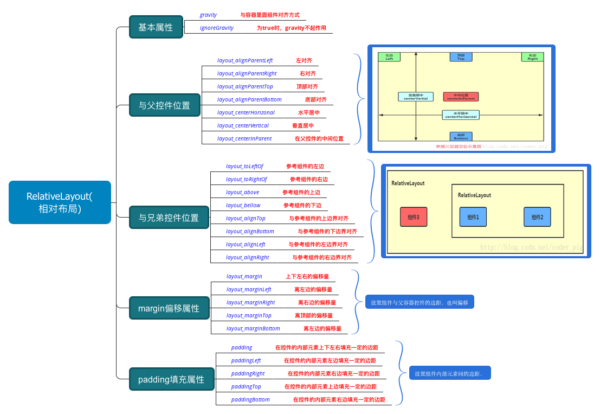
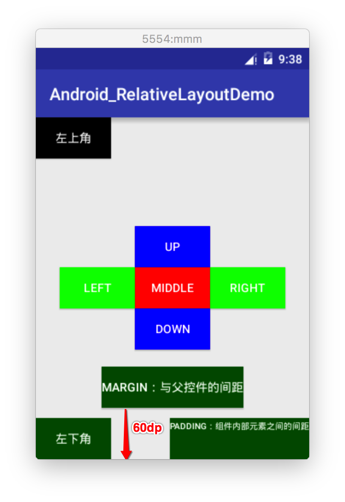

## RelativeLayout(相对布局)
1. LinerLayout的缺陷，就是当界面比较复杂的时候，需要嵌套多层的 LinearLayout,这样就会降低UI Render的效率(渲染速度),而且如果是listview或者GridView上的 item,效率会更低,另外太多层LinearLayout嵌套会占用更多的系统资源,还有可能引发stackoverflow，而RelativeLayout的话,可能仅仅需要一层就可以完成了,以父容器或者兄弟组件参考+margin +padding就可以设置组件的显示位置，所以我们通常LinerLayout和RelativeLayout代培使用。

2. 我们先来看看RelativeLayout的主要的属性图


3. 常见的梅花布局代码示例：
```java
<?xml version="1.0" encoding="utf-8"?>
<RelativeLayout xmlns:android="http://schemas.android.com/apk/res/android"
    xmlns:tools="http://schemas.android.com/tools"
    android:layout_width="match_parent"
    android:layout_height="match_parent"
    tools:context="wdy.com.android_relativelayoutdemo.MainActivity">

    <!--android:layout_centerVertical="true" -->
    <!--android:layout_centerHorizontal="true"-->
    <!--上面两句相当于：android:layout_centerInParent="true",居中显示-->
    <Button
        android:id="@+id/middle"
        android:layout_width="wrap_content"
        android:layout_height="wrap_content"
        android:layout_centerInParent="true"
        android:text="middle"
        android:textColor="#fff"
        android:background="#f00"
        />
    <!--上边-->
    <Button
        android:layout_width="wrap_content"
        android:layout_height="wrap_content"
        android:layout_above="@id/middle"
        android:layout_centerHorizontal="true"
        android:text="up"
        android:textColor="#fff"
        android:background="#00f"
        />
    <!--下边-->
    <Button
        android:layout_width="wrap_content"
        android:layout_height="wrap_content"
        android:layout_below="@id/middle"
        android:layout_centerHorizontal="true"
        android:text="down"
        android:textColor="#fff"
        android:background="#00f"
        />
    <!--左-->
    <Button
        android:layout_width="wrap_content"
        android:layout_height="wrap_content"
        android:layout_toLeftOf="@id/middle"
        android:layout_centerVertical="true"
        android:text="left"
        android:textColor="#fff"
        android:background="#0f0"
        />
    <!--右-->
    <Button
        android:layout_width="wrap_content"
        android:layout_height="wrap_content"
        android:layout_toRightOf="@id/middle"
        android:layout_centerVertical="true"
        android:text="right"
        android:textColor="#fff"
        android:background="#0f0"
        />
    <!--左上角-->
    <!--在左上角，我们并没有添加android:layout_alignParentLeft="true",而是默认在父窗体的左边-->
    <Button
        android:layout_width="wrap_content"
        android:layout_height="wrap_content"
        android:layout_alignParentTop="true"
        android:text="左上角"
        android:textColor="#fff"
        android:background="#000"
        />
    <!--左下角-->
    <Button
        android:id="@+id/left_bottom_corner"
        android:layout_width="wrap_content"
        android:layout_height="wrap_content"
        android:layout_alignParentBottom="true"
        android:text="左下角"
        android:textColor="#fff"
        android:background="#050"
        />
    
    <!--下面两个按钮是对比margin和padding的区别-->
    <Button
        android:layout_width="wrap_content"
        android:layout_height="wrap_content"
        android:layout_alignParentBottom="true"
        android:text="margin：与父控件的间距"
        android:layout_centerHorizontal="true"
        android:layout_marginBottom="60dp"
        android:textColor="#fff"
        android:background="#050"
        />

    <Button
        android:layout_width="wrap_content"
        android:layout_height="wrap_content"
        android:layout_alignParentBottom="true"
        android:layout_alignParentRight="true"
        android:text="padding：组件内部元素之间的间距"
        android:textSize="10dp"
        android:layout_centerHorizontal="true"
        android:paddingBottom="30dp"
        android:textColor="#fff"
        android:background="#050"
        />
</RelativeLayout>
```

实现效果图：


