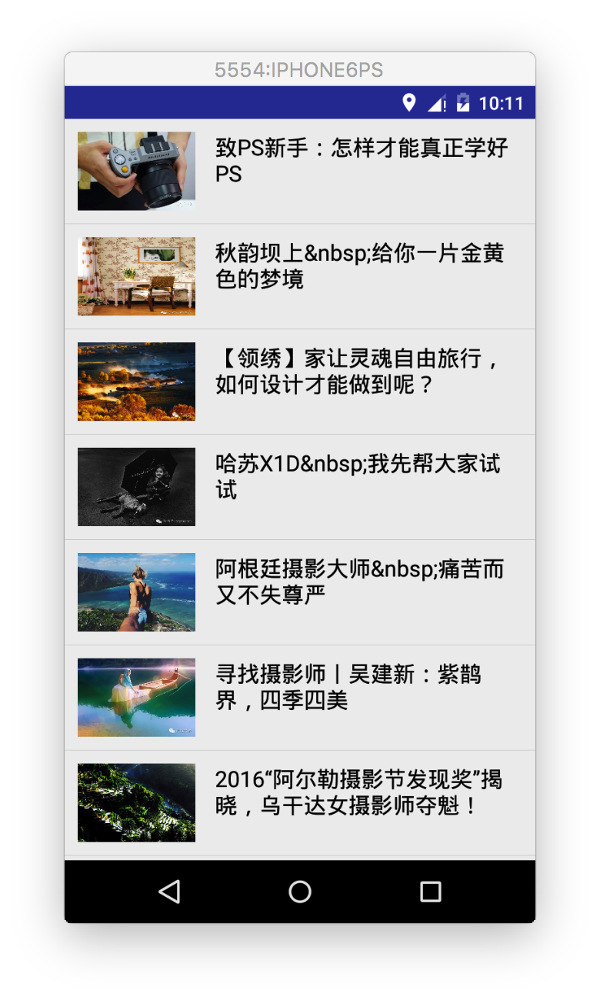

列表作为最常用的控件之一，ListView虽然被后来的RecyclerView这个新控件替换掉了，但还是值得我们去了解和学习，在这里主要介绍ListView的属性，以及BaseAdapter简单定义，还有ListView优化这些，[Demo](https://github.com/wangdongyang/AndroidEveryDay/tree/master/project/BaseAdapterAndListViewDemo)在这里。
	
#### 1.  ListView与自定义的BaseAdapter的简单实现
先来看看下面的实现效果：


一个很简单的ListView，自己写下Item，然后从本地加载数据，`ArticleItem`里面的实现：

```java

/**
 * Created by wdy on 16/7/12.
 */
public class ArticleItem {

    public String getTitle() {
        return title;
    }

    public int getImage() {
        return image;
    }

    public void setTitle(String title) {
        this.title = title;
    }

    public void setImage(int image) {
        this.image = image;
    }

    private String title;
    private int image;

    public ArticleItem(){

    }

    public ArticleItem(String title, int image){
        this.title = title;
        this.image = image;
    }
}
```

这个是item的布局文件`item_list_article.xml`，用的是`RelativeLayout`，一个`ImageView`和`TextView`简单的显示一下

```java
<?xml version="1.0" encoding="utf-8"?>
<RelativeLayout xmlns:android="http://schemas.android.com/apk/res/android"
    android:layout_width="match_parent"
    android:layout_height="match_parent">

    <ImageView
        android:id="@+id/list_item_iv"
        android:layout_width="90dp"
        android:layout_height="60dp"
        android:layout_marginBottom="10dp"
        android:layout_marginLeft="10dp"
        android:layout_marginTop="10dp"
        />

    <TextView
        android:id="@+id/list_item_tv"
        android:layout_marginTop="10dp"
        android:layout_marginRight="10dp"
        android:paddingLeft="15dp"
        android:layout_toRightOf="@id/list_item_iv"
        android:textColor="#000"
        android:textSize="17sp"
        android:layout_width="wrap_content"
        android:layout_height="wrap_content" />
</RelativeLayout>
```

这是`MainActivity`里面的实现：

```java
public class MainActivity extends Activity {

    private ArrayList<ArticleItem> dataList = new ArrayList<ArticleItem>();
    private ListView lv;
    @Override
    protected void onCreate(Bundle savedInstanceState) {
        super.onCreate(savedInstanceState);
        setContentView(R.layout.activity_main);

        dataList.add(new ArticleItem("致PS新手：怎样才能真正学好PS", R.drawable.imga01));
        dataList.add(new ArticleItem("秋韵坝上&nbsp;给你一片金黄色的梦境", R.drawable.imga02));
        dataList.add(new ArticleItem("【领绣】家让灵魂自由旅行，如何设计才能做到呢？", R.drawable.imga03));
        dataList.add(new ArticleItem("哈苏X1D&nbsp;我先帮大家试试", R.drawable.imga04));
        dataList.add(new ArticleItem("阿根廷摄影大师&nbsp;痛苦而又不失尊严", R.drawable.imga05));
        dataList.add(new ArticleItem("寻找摄影师丨吴建新：紫鹊界，四季四美", R.drawable.imga06));
        dataList.add(new ArticleItem("2016“阿尔勒摄影节发现奖”揭晓，乌干达女摄影师夺魁！", R.drawable.imga07));

        lv = (ListView)findViewById(R.id.lv);
        lv.setAdapter(new MyAdapter());
    }

    public class MyAdapter extends BaseAdapter {

        @Override
        public int getCount() {
            return dataList.size();
        }

        @Override
        public Object getItem(int position) {
            return null;
        }

        @Override
        public long getItemId(int position) {
            return position;
        }

        @Override
        public View getView(int position, View convertView, ViewGroup parent) {
            convertView = LayoutInflater.from(getApplicationContext()).inflate(R.layout.item_list_article,parent,false);
            ImageView img_icon = (ImageView) convertView.findViewById(R.id.list_item_iv);
            TextView txt_aName = (TextView) convertView.findViewById(R.id.list_item_tv);
            img_icon.setBackgroundResource(dataList.get(position).getImage());
            txt_aName.setText(dataList.get(position).getTitle());
            return convertView;
        }
    }
}
```
以上只是简单的示例代码，优化的地方还有很多，后面会慢慢介绍到