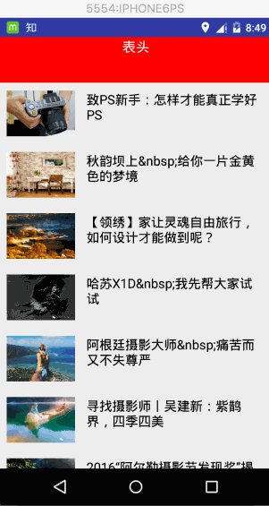
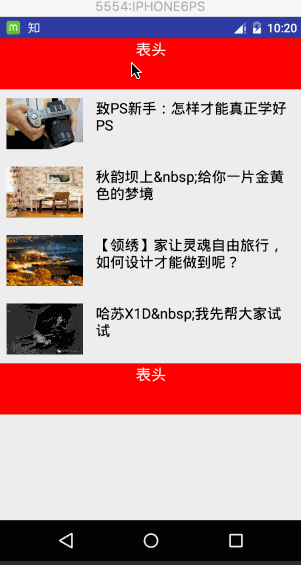

列表作为最常用的控件之一，ListView虽然被后来的RecyclerView这个新控件替换掉了，但还是值得我们去了解和学习，在这里主要介绍ListView的属性，以及BaseAdapter简单定义，还有ListView优化这些，[Demo](https://github.com/wangdongyang/AndroidEveryDay/tree/master/project/BaseAdapterAndListViewDemo)在这里。
 
#### 1.  ListView与自定义的BaseAdapter的简单实现
先来看看下面的实现效果：


一个很简单的ListView，自己写下Item，然后从本地加载数据，`ArticleItem`里面的实现：

```java

/*
 * Created by wdy on 16/7/12.
 */
public class ArticleItem {

	public String getTitle() {
	    return title;
	}
	
	public int getImage() {
	    return image;
	}
	
	public void setTitle(String title) {
	    this.title = title;
	}
	
	public void setImage(int image) {
	    this.image = image;
	}
	
	private String title;
	private int image;
	
	public ArticleItem(){
	
	}
	
	public ArticleItem(String title, int image){
	    this.title = title;
	    this.image = image;
	}
}
```

这个是item的布局文件`item_list_article.xml`，用的是`RelativeLayout`，一个`ImageView`和`TextView`简单的显示一下

```java

<?xml version="1.0" encoding="utf-8"?\>
<RelativeLayout xmlns:android="http://schemas.android.com/apk/res/android"
	android:layout_width="match_parent"
	android:layout_height="match_parent">
	
	<ImageView
	    android:id="@+id/list_item_iv"
	    android:layout_width="90dp"
	    android:layout_height="60dp"
	    android:layout_marginBottom="10dp"
	    android:layout_marginLeft="10dp"
	    android:layout_marginTop="10dp"
	    />
	
	<TextView
	    android:id="@+id/list_item_tv"
	    android:layout_marginTop="10dp"
	    android:layout_marginRight="10dp"
	    android:paddingLeft="15dp"
	    android:layout_toRightOf="@id/list_item_iv"
	    android:textColor="#000"
	    android:textSize="17sp"
	    android:layout_width="wrap_content"
	    android:layout_height="wrap_content" />
</RelativeLayout>
```

这是`MainActivity`里面的实现：

```java

public class MainActivity extends Activity {
	private ArrayList<ArticleItem> dataList = new ArrayList<ArticleItem>();
	private ListView lv;
	@Override
	protected void onCreate(Bundle savedInstanceState) {
	    super.onCreate(savedInstanceState);
	    setContentView(R.layout.activity_main);
	
	    dataList.add(new ArticleItem("致PS新手：怎样才能真正学好PS", R.drawable.imga01));
	    dataList.add(new ArticleItem("秋韵坝上&nbsp;给你一片金黄色的梦境", R.drawable.imga02));
	    dataList.add(new ArticleItem("【领绣】家让灵魂自由旅行，如何设计才能做到呢？", R.drawable.imga03));
	    dataList.add(new ArticleItem("哈苏X1D&nbsp;我先帮大家试试", R.drawable.imga04));
	    dataList.add(new ArticleItem("阿根廷摄影大师&nbsp;痛苦而又不失尊严", R.drawable.imga05));
	    dataList.add(new ArticleItem("寻找摄影师丨吴建新：紫鹊界，四季四美", R.drawable.imga06));
	    dataList.add(new ArticleItem("2016“阿尔勒摄影节发现奖”揭晓，乌干达女摄影师夺魁！", R.drawable.imga07));
	
	    lv = (ListView)findViewById(R.id.lv);
	    lv.setAdapter(new MyAdapter());
	}
	
	public class MyAdapter extends BaseAdapter {
	
	    @Override
	    public int getCount() {
	        return dataList.size();
	    }
	
	    @Override
	    public Object getItem(int position) {
	        return null;
	    }
	
	    @Override
	    public long getItemId(int position) {
	        return position;
	    }
	
	    @Override
	    public View getView(int position, View convertView, ViewGroup parent) {
	        convertView = LayoutInflater.from(getApplicationContext()).inflate(R.layout.item_list_article,parent,false);
	        ImageView img_icon = (ImageView) convertView.findViewById(R.id.list_item_iv);
	        TextView txt_aName = (TextView) convertView.findViewById(R.id.list_item_tv);
	        img_icon.setBackgroundResource(dataList.get(position).getImage());
	        txt_aName.setText(dataList.get(position).getTitle());
	        return convertView;
	    }
	}
}
```
以上只是简单的示例代码，优化的地方还有很多，后面会慢慢介绍到
#### 2. 设置listView的表头表尾和分割线
下面是关于分割线的属性：
	
	footerDividersEnabled：是否在footerView(表尾)前绘制一个分隔条,默认为true
	headerDividersEnabled:是否在headerView(表尾)前绘制一个分隔条,默认为true
	divider:设置分隔条,可以用颜色分割,也可以用drawable资源分割
	dividerHeight:设置分隔条的高度

表头表尾的属性只能通过java代码来设置：
	
	addHeaderView(View v)：添加headView(表头),括号中的参数是一个View对象
	addFooterView(View v)：添加footerView(表尾)，括号中的参数是一个View对象
	addHeaderView(headView, null, false)：和前面的区别：设置Header是否可以被选中
	addFooterView(View,view,false)：同上
***注意：表头表尾必须放在listview.setAdapter前面，否则会报错***
下面是实例代码：
`header_view.xml`文件里面写的
```java
<?xml version="1.0" encoding="utf-8"?>
<LinearLayout xmlns:android="http://schemas.android.com/apk/res/android"
    android:layout_width="match_parent"
    android:layout_height="match_parent"
    android:orientation="vertical"
    android:gravity="center">

    <TextView
        android:layout_width="match_parent"
        android:layout_height="60dp"
        android:textSize="18dp"
        android:text="表头"
        android:textAlignment="center"
        android:textColor="#fff"
        android:background="#f00"/>
</LinearLayout>
```

`MainActivity`文件写的：

```java
public class MainActivity extends Activity implements AdapterView.OnItemClickListener {

    private ArrayList<ArticleItem> dataList = new ArrayList<ArticleItem>();
    private ListView lv;
    @Override
    protected void onCreate(Bundle savedInstanceState) {
        super.onCreate(savedInstanceState);
        setContentView(R.layout.activity_main);

        dataList.add(new ArticleItem("致PS新手：怎样才能真正学好PS", R.drawable.imga01));
        dataList.add(new ArticleItem("秋韵坝上&nbsp;给你一片金黄色的梦境", R.drawable.imga02));
        dataList.add(new ArticleItem("【领绣】家让灵魂自由旅行，如何设计才能做到呢？", R.drawable.imga03));
        dataList.add(new ArticleItem("哈苏X1D&nbsp;我先帮大家试试", R.drawable.imga04));
        dataList.add(new ArticleItem("阿根廷摄影大师&nbsp;痛苦而又不失尊严", R.drawable.imga05));
        dataList.add(new ArticleItem("寻找摄影师丨吴建新：紫鹊界，四季四美", R.drawable.imga06));
        dataList.add(new ArticleItem("2016“阿尔勒摄影节发现奖”揭晓，乌干达女摄影师夺魁！", R.drawable.imga07));
        dataList.add(new ArticleItem("致PS新手：怎样才能真正学好PS", R.drawable.imga01));
        dataList.add(new ArticleItem("秋韵坝上&nbsp;给你一片金黄色的梦境", R.drawable.imga02));
        dataList.add(new ArticleItem("【领绣】家让灵魂自由旅行，如何设计才能做到呢？", R.drawable.imga03));
        dataList.add(new ArticleItem("哈苏X1D&nbsp;我先帮大家试试", R.drawable.imga04));
        dataList.add(new ArticleItem("阿根廷摄影大师&nbsp;痛苦而又不失尊严", R.drawable.imga05));
        dataList.add(new ArticleItem("寻找摄影师丨吴建新：紫鹊界，四季四美", R.drawable.imga06));
        dataList.add(new ArticleItem("2016“阿尔勒摄影节发现奖”揭晓，乌干达女摄影师夺魁！", R.drawable.imga07));

        lv = (ListView)findViewById(R.id.lv);
        //动态加载顶部View和底部View
        final LayoutInflater inflater = LayoutInflater.from(this);
        View headView = inflater.inflate(R.layout.header_view, null, false);
        View footView = inflater.inflate(R.layout.header_view, null, false);

        lv.addHeaderView(headView);
        lv.addFooterView(footView);

        lv.setAdapter(new MyAdapter());

        lv.setOnItemClickListener(this);
    }

    @Override
    public void onItemClick(AdapterView<?> parent, View view, int position, long id) {
        Toast.makeText(getApplicationContext(),"你点击了第" + position + "项",Toast.LENGTH_SHORT).show();
    }

    public class MyAdapter extends BaseAdapter {

        @Override
        public int getCount() {
            return dataList.size();
        }

        @Override
        public Object getItem(int position) {
            return null;
        }

        @Override
        public long getItemId(int position) {
            return position;
        }

        @Override
        public View getView(int position, View convertView, ViewGroup parent) {
            convertView = LayoutInflater.from(getApplicationContext()).inflate(R.layout.item_list_article,parent,false);
            ImageView img_icon = (ImageView) convertView.findViewById(R.id.list_item_iv);
            TextView txt_aName = (TextView) convertView.findViewById(R.id.list_item_tv);
            img_icon.setBackgroundResource(dataList.get(position).getImage());
            txt_aName.setText(dataList.get(position).getTitle());
            return convertView;
        }
    }
}
```
实现效果：


***注意：上面的gif看到添加表头表尾后，positon是从表头开始算的，点击headerView是ListView的第一项，***

#### 3. 列表从底部开始显示，tackFromBottom 属性设置为true即可
#### 4. 设置点击颜色cacheColorHint，此属性用于为listView设置背景图片时，去掉listView空白位置背景变黑的情况
#### 5. 隐藏滑动条：android:scrollbars="none" 或setVerticalScrollBarEnabled(true)

===
***以上是ListView的基本用法，下面来撸一下如何来优化这个BaseAdapter***

#### 6. BaseAdapter优化

a. 先来说说为什么要优化：从上面的代码可以看出比较重要的两个方法:getCount()和getView()，dataList.size长度决定有多少列的item就会调用多少次getView， 这个时候每次都是新inflate一个View，都要进行这个XML的解析，这样很浪费，特别实在比较复杂的布局上面就会体现出来，
b. 优化方法：**复用convertView 以及使用ViewHolder重用组件，不用每次都findViewById**

##### 复用ConvertView
我们在上面的代码的基础上进行优化之后：其实这个convertView是系统提供给我们的可供复用的View 的缓存对象，那就先判断，若不存在再去创建。效果图跟上面一样的

```java
@Override
public View getView(int position, View convertView, ViewGroup parent) {
    if (convertView == null){
        convertView = LayoutInflater.from(getApplicationContext()).inflate(R.layout.item_list_article,parent,false);
    }
    ImageView img_icon = (ImageView) convertView.findViewById(R.id.list_item_iv);
    TextView txt_aName = (TextView) convertView.findViewById(R.id.list_item_tv);
    img_icon.setBackgroundResource(dataList.get(position).getImage());
    txt_aName.setText(dataList.get(position).getTitle());
    return convertView;
}
```
##### ViewHolder重用组件
我们发现getView()被调用多次的同时findViewById()也会被调用多次，而我们的ListView的Item大多数情况下都是一样的布局，此时我们可以自己定义一个ViewHolder类来对这一部分 进行性能优化，修改后的代码如下：
```java
public class MyAdapter extends BaseAdapter {

        @Override
        public int getCount() {
            return dataList.size();
        }

        @Override
        public Object getItem(int position) {
            return null;
        }

        @Override
        public long getItemId(int position) {
            return position;
        }

        @Override
        public View getView(int position, View convertView, ViewGroup parent) {
            ViewHolder holder = null;

            if (convertView == null){
                convertView = LayoutInflater.from(getApplicationContext()).inflate(R.layout.item_list_article,parent,false);
                holder = new ViewHolder();
                holder.iconImage = (ImageView) convertView.findViewById(R.id.list_item_iv);
                holder.titleName = (TextView) convertView.findViewById(R.id.list_item_tv);
                convertView.setTag(holder);   //将Holder存储到convertView中
            }else{
                holder = (ViewHolder) convertView.getTag();
            }
            holder.iconImage.setBackgroundResource(dataList.get(position).getImage());
            holder.titleName.setText(dataList.get(position).getTitle());
            return convertView;
        }
    }

    static class ViewHolder{
        ImageView iconImage;
        TextView titleName;
    }
```
以上优化是网上看文章得来的，具体是谁我也不记得了，先谢谢了！目前对BaseAdapter做了一个很简单的优化，当然还有更多更好的实现方式，后面有空再加上去。

#### 7.下面总结开发过程中关于ListView碰到的几个问题。
##### ListView的焦点问题
在ListView的Item中添加了Button，CheckBox，EditText等控件的，当我们点击发现的时候， ListView的item点击不了，触发不了onItemClick的方法，也触发不了onItemLongClick方法。原因：ListView的焦点被其他控件抢了
解决办法：

	1. 给抢占了ListView Item焦点的控件设置android:focusable="false"即可解决这个问题 
	2. item根节点设置android:descendantFocusability="blocksDescendants"，另外该属性有三个可供选择的值：
		beforeDescendants：viewgroup会优先其子类控件而获取到焦点
		afterDescendants：viewgroup只有当其子类控件不需要获取焦点时才获取焦点
		blocksDescendants：viewgroup会覆盖子类控件而直接获得焦点

###### ListView的数据更新(增、删、改)
还是拿上面的例子来说，当点击listView的headerView的时候我们来增加一条数据试试，

```java
@Override
public void onItemClick(AdapterView<?> parent, View view, int position, long id) {
//        Toast.makeText(getApplicationContext(),"你点击了第" + position + "项",Toast.LENGTH_SHORT).show();
   dataList.add(new ArticleItem("【领绣】家让灵魂自由旅行，如何设计才能做到呢？", R.drawable.imga03));

   // 在某一个位置添加一个item
//        dataList.add(2,new ArticleItem("【领绣】家让灵魂自由旅行，如何设计才能做到呢？", R.drawable.imga03))
   myAdapter.notifyDataSetChanged();
}
```
效果：



其实就是操作dataList里面的数据，然后调用`myAdapter.notifyDataSetChanged();`方法来刷新数据，删除操作也是一样的，不同的是更新某一行的item的数据，我们来看看具体的操作。

```java
private void updateListItem(int postion,ArticleItem item){
    int visiblePosition = lv.getFirstVisiblePosition();
    View v = lv.getChildAt(postion - visiblePosition);
    ImageView img = (ImageView) v.findViewById(R.id.list_item_iv);
    TextView tv = (TextView) v.findViewById(R.id.list_item_tv);
    img.setImageResource(item.getImage());
    tv.setText(item.getTitle());
}
```

至此，我们大概介绍了ListView的相关知识，后面有时间再来介绍ListView的升级版RecyclerView，先到这里了。


