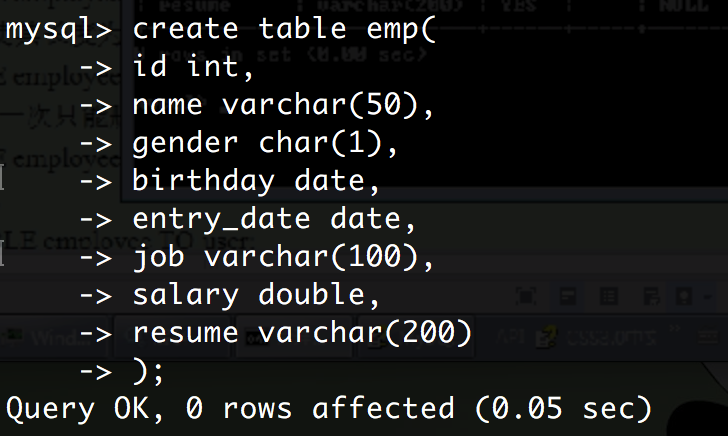
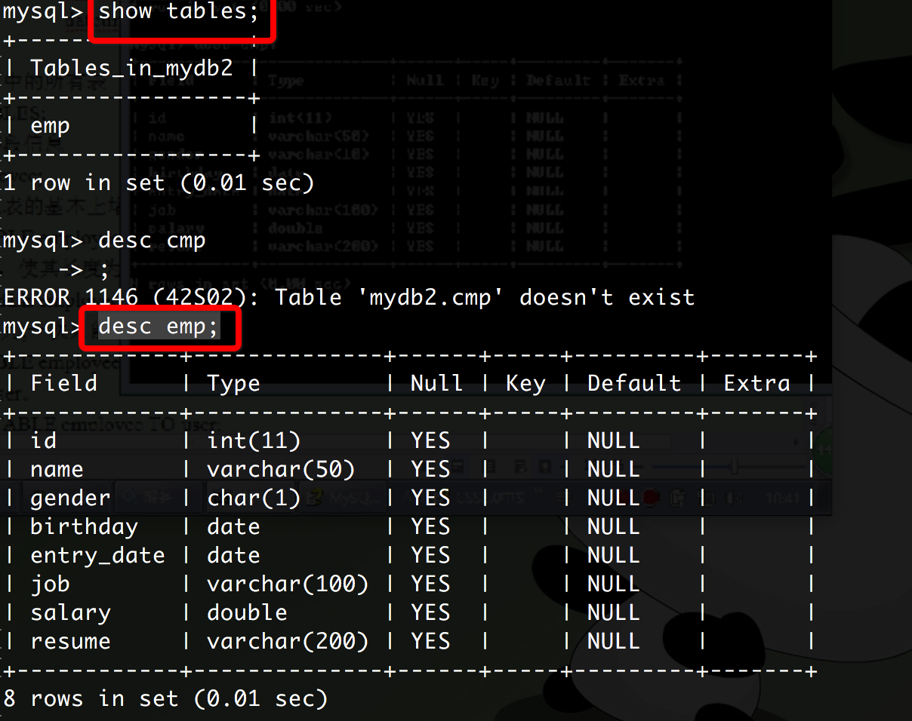
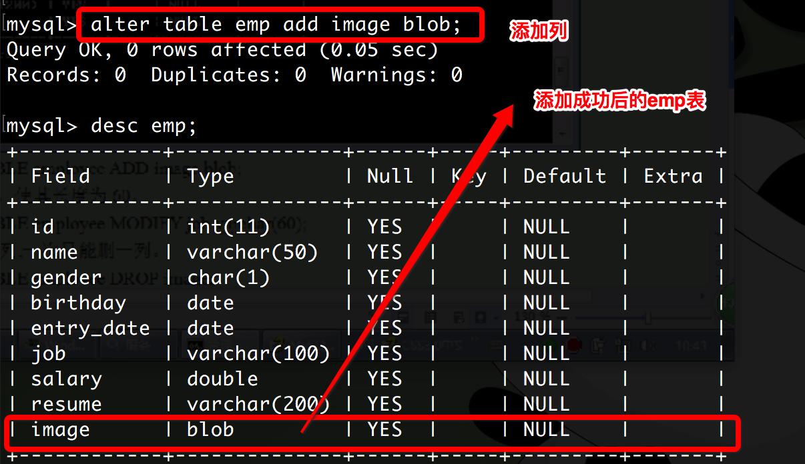
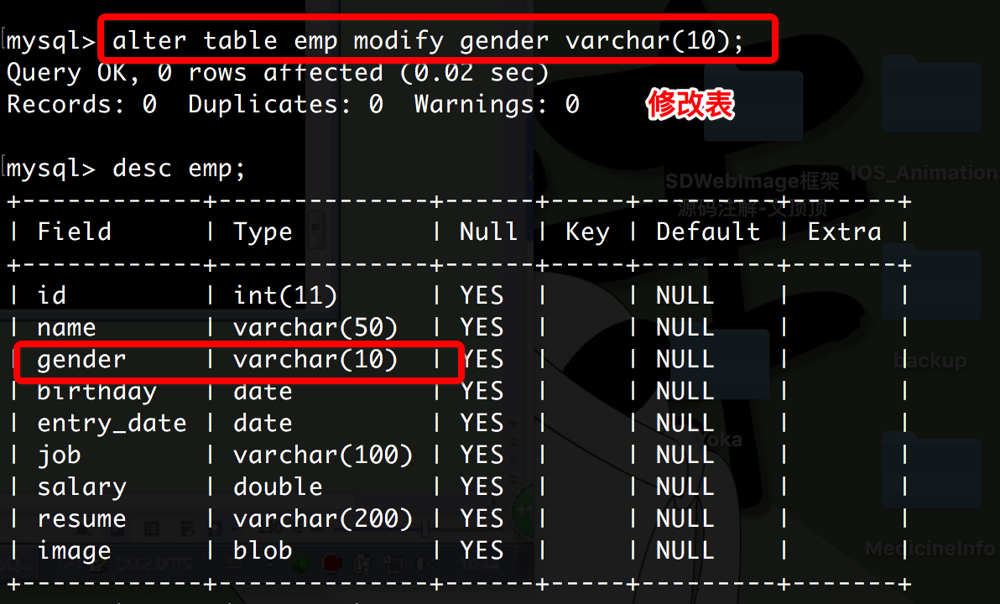

# MySql命令

### 操作数据库

```
// 登录 - 然后输入密码
mysql -u root -p

// 查看所有库
show DATABASES;

// 创建数据库
create database mydb1

// 创建数据库，并指定字符集为'gbk'，不指定默认为'utf-8'
create database mydb2 character set gbk;

// 查看某一条数据库
show create database mydb2;

// 删除某一条数据库
drop database mydb2;

// 修改数据库，修改'mydb2'的字符集为'utf8'
alter database mydb2 character set utf8;

// 使用数据库
use mydb2;

// 查看当前使用的数据库
select database();

```

### 操作表

常用数据类型：

* int：整型
* double：浮点型，例如double(5,2)表示最多5位，其中必须有2位小数，即最大值为999.99；
* char：固定长度字符串类型； char(10)  'abc       '
* varchar：可变长度字符串类型；varchar(10) 'abc'
* text：字符串类型;
* blob：字节类型；
* date：日期类型，格式为：yyyy-MM-dd；
* time：时间类型，格式为：hh:mm:ss
* timestamp：时间戳类型 yyyy-MM-dd hh:mm:ss  会自动赋值
* datetime:日期时间类型 yyyy-MM-dd hh:mm:ss


```
// 创建表员工表
create table emp(
    id int,
    name varchar(50),
    gender char(1),
    birthday date,
    entry_date date,
    job varchar(100),
    salary double,
    resume varchar(200)
    );

```



``` 
// 查看当前数据库中所有表 
show tables

// 查看表中字段信息
desc emp;
```



```
// 添加列，blob为字节类型
alter table emp add image blob;

```


```
// 修改，将'gender'由原来的'char' 修改为‘varchar’类型
alter table emp modify gender varchar(10);

```

 

```
// 删除列
alter table emp drop image;

// 更改表名
rename table emp to user; 

// 查看表的创建细节
show create table user; //或者格式化显示：show create table user \G;

// 修改'name'为'username'
alter table user change name username varchar(100);

// 删除所有表
drop table user;

```

### DML操作
```
-- 查询表中的所有数据 
SELECT * FROM emp;

-- 向emp表中添加数据
INSERT INTO emp(id,NAME,gender,birthday,salary,entry_date,RESUME)
VALUES(1,'tom','m','2015-09-24',10000,'2015-09-25','IOS developer');

-- 将所有员工薪水修改为5000元。
UPDATE emp SET salary=5000;
-- 将姓名为’tom’的员工薪水修改为3000元。if(name=='tom')
UPDATE emp SET salary=3000 WHERE NAME='joy';
-- 将姓名为’jerry’的员工薪水修改为4000元,job改为ccc。
UPDATE emp SET salary=4000,gender='m' WHERE NAME='jerry';
-- 将wu的薪水在原有基础上增加1000元。
UPDATE emp SET salary=salary+1000 WHERE NAME='菜10';
	
-- Delete语句
-- 删除表中名称为’tom’的记录。
DELETE FROM emp WHERE NAME='tom';
-- 删除表中所有记录。可以通过日志恢复
DELETE FROM emp;
-- 使用truncate删除表中记录。不可恢复
TRUNCATE TABLE emp;

-- SELECT语句
SELECT NAME,gender FROM emp;

-- 查询练习- ----------- 

CREATE TABLE stu (
	sid	CHAR(6),
	sname		VARCHAR(50),
	age		INT,
	gender	VARCHAR(50)
);

INSERT INTO stu VALUES('S_1001', 'liuYi', 35, 'male');
INSERT INTO stu VALUES('S_1002', 'chenEr', 15, 'female');
INSERT INTO stu VALUES('S_1003', 'zhangSan', 95, 'male');
INSERT INTO stu VALUES('S_1004', 'liSi', 65, 'female');
INSERT INTO stu VALUES('S_1005', 'wangWu', 55, 'male');
INSERT INTO stu VALUES('S_1006', 'zhaoLiu', 75, 'female');
INSERT INTO stu VALUES('S_1007', 'sunQi', 25, 'male');
INSERT INTO stu VALUES('S_1008', 'zhouBa', 45, 'female');
INSERT INTO stu VALUES('S_1009', 'wuJiu', 85, 'male');
INSERT INTO stu VALUES('S_1010', 'zhengShi', 5, 'female');
INSERT INTO stu VALUES('S_1011', 'xxx', NULL, NULL);


CREATE TABLE emp(
	empno		INT,
	ename		VARCHAR(50),
	job		VARCHAR(50),
	mgr		INT,
	hiredate	DATE,
	sal		DECIMAL(7,2),
	comm		DECIMAL(7,2),
	deptno		INT
) ;

INSERT INTO emp VALUES(7369,'SMITH','CLERK',7902,'1980-12-17',800,NULL,20);
INSERT INTO emp VALUES(7499,'ALLEN','SALESMAN',7698,'1981-02-20',1600,300,30);
INSERT INTO emp VALUES(7521,'WARD','SALESMAN',7698,'1981-02-22',1250,500,30);
INSERT INTO emp VALUES(7566,'JONES','MANAGER',7839,'1981-04-02',2975,NULL,20);
INSERT INTO emp VALUES(7654,'MARTIN','SALESMAN',7698,'1981-09-28',1250,1400,30);
INSERT INTO emp VALUES(7698,'BLAKE','MANAGER',7839,'1981-05-01',2850,NULL,30);
INSERT INTO emp VALUES(7782,'CLARK','MANAGER',7839,'1981-06-09',2450,NULL,10);
INSERT INTO emp VALUES(7788,'SCOTT','ANALYST',7566,'1987-04-19',3000,NULL,20);
INSERT INTO emp VALUES(7839,'KING','PRESIDENT',NULL,'1981-11-17',5000,NULL,10);
INSERT INTO emp VALUES(7844,'TURNER','SALESMAN',7698,'1981-09-08',1500,0,30);
INSERT INTO emp VALUES(7876,'ADAMS','CLERK',7788,'1987-05-23',1100,NULL,20);
INSERT INTO emp VALUES(7900,'JAMES','CLERK',7698,'1981-12-03',950,NULL,30);
INSERT INTO emp VALUES(7902,'FORD','ANALYST',7566,'1981-12-03',3000,NULL,20);
INSERT INTO emp VALUES(7934,'MILLER','CLERK',7782,'1982-01-23',1300,NULL,10);

CREATE TABLE dept(
	deptno		INT,
	dname		VARCHAR(14),
	loc		VARCHAR(13)
);
INSERT INTO dept VALUES(10, 'ACCOUNTING', 'NEW YORK');
INSERT INTO dept VALUES(20, 'RESEARCH', 'DALLAS');
INSERT INTO dept VALUES(30, 'SALES', 'CHICAGO');
INSERT INTO dept VALUES(40, 'OPERATIONS', 'BOSTON');

SELECT * FROM dept;
SELECT * FROM emp;
SELECT * FROM stu;

-- 1.2　查询指定列
SELECT sid,sname,age FROM stu;  
-- 2.2　查询性别为女，并且年龄大于等于50的记录
SELECT *FROM stu WHERE gender='female' AND age>=50;
-- 2.3　查询学号为S_1001，或者姓名为liSi， 或者性别为‘male’的记录
SELECT *FROM stu WHERE sid='s_1001' OR sname='lisi' OR gender='male';
-- 2.4　查询学号为S_1001，S_1002，S_1003的记录
SELECT * FROM stu WHERE sid='S_1001' OR sid='S_1002' OR sid='S_1003';
-- 或者这样写，适合用于固定的范围之类
SELECT *FROM stu WHERE sid IN('S_1001','S_1002','S_1003');
-- 2.5　查询学号不是S_1001，S_1002，S_1003的记录
SELECT *FROM stu WHERE sid NOT IN('S_1001','S_1002','S_1003');
-- 2.6　查询年龄为null的记录
SELECT *FROM stu WHERE age is NULL;
SELECT *FROM stu WHERE age is NOT NULL; -- 不为空
-- 2.7　查询年龄在20到40之间的学生记录
SELECT * FROM stu WHERE age>=20 AND age<=40;
SELECT * FROM stu WHERE age BETWEEN 20 AND 40; -- 和上面效果是一样
-- 2.8　查询性别非男的学生记录
SELECT * FROM stu WHERE gender='female';
SELECT * FROM stu WHERE gender!='male';
-- 和上面一句是一样的
SELECT * FROM stu WHERE gender<>'male';
-- 2.9　查询姓名不为null的学生记录
SELECT * FROM stu WHERE sname IS NOT NULL;

-- 模糊查询：‘_’表示任意一个字符，‘%’任意0~n哥字符
-- 3.1　查询姓名由5个字母构成的学生记录
SELECT * FROM stu WHERE sname LIKE '_____';
-- 3.2　查询姓名由5个字母构成，并且第5个字母为“i”的学生记录
SELECT * FROM stu WHERE sname LIKE '____i';
-- 3.3　查询姓名以“z”开头的学生记录
SELECT * FROM stu WHERE sname LIKE 'z%';
-- 3.4　查询姓名中第2个字母为“i”的学生记录
SELECT * FROM stu WHERE sname LIKE '_i%';
-- 3.5　查询姓名中包含“a”字母的学生记录
SELECT * FROM stu WHERE sname LIKE '%a%';

-- 字段控制查询
-- 查询所有部门，去掉重复数据
SELECT DISTINCT deptno FROM emp;
-- 4.2　查看雇员的月薪与佣金之和
SELECT * FROM emp;
SELECT sal+IFNULL(comm,0) FROM emp;
-- 给列起别名
SELECT *,sal+IFNULL(comm,0) AS total FROM emp;
-- AS可以不写，空格默认就是AS
SELECT sname AS 姓名, gender 性别 FROM stu;

-- 排序查询
-- 5.1　查询所有学生记录，按年龄升序排序
SELECT * FROM stu ORDER BY age ASC;
SELECT * FROM stu ORDER BY age;  -- 默认升序
-- 5.2　查询所有学生记录，按年龄降序排序
SELECT * FROM stu ORDER BY age DESC;
-- 5.3　查询所有雇员，按月薪降序排序，如果月薪相同时，按编号升序排序
SELECT * FROM emp ORDER BY sal ,empno DESC;

-- 聚合函数：sum avg max min count
-- 查询有年龄信息的学生人数
SELECT COUNT(age) FROM stu;
-- 查询emp表中有佣金的人数：
SELECT COUNT(comm) FROM emp;
-- 查询emp表中月薪大于2500的人数：
SELECT COUNT(*) FROM emp WHERE sal>2500;
-- 统计月薪与佣金之和大于2500元的人数：
SELECT COUNT(*) FROM emp WHERE (sal+IFNULL(comm,0))>2500;
-- 查询有佣金的人数，有领导的人数：
SELECT COUNT(comm),COUNT(mgr) FROM emp;
-- 查询有佣金的人数，以及有领导的人数：
SELECT COUNT(*) FROM emp WHERE comm IS NOT NULL AND mgr IS NOT NULL;
-- 查询所有雇员月薪和：
SELECT SUM(sal) FROM emp;
-- 查询所有雇员月薪和，以及所有雇员佣金和：
SELECT SUM(sal),SUM(comm) FROM emp;
-- 查询所有雇员月薪+佣金和：
SELECT SUM(sal+IFNULL(comm,0)) FROM emp;
SELECT SUM(sal)+SUM(comm) FROM emp;
-- 统计所有员工平均工资：
SELECT AVG(sal) FROM emp;
-- 查询最高工资和最低工资：
SELECT MAX(sal),MIN(sal) FROM emp;

-- 分组查询
SELECT COUNT(*) FROM stu WHERE gender='male' OR gender='female';
-- 根据性别分组：结果为5、5两组
SELECT COUNT(*) FROM stu WHERE gender IS NOT NULL GROUP BY gender;
SELECT COUNT(*) FROM stu WHERE gender IS NOT NULL GROUP BY gender;
-- 查询各部门的人数
SELECT deptno,COUNT(*) FROM emp GROUP BY deptno;
-- 查询每个部门的部门编号和每个部门的工资和：
SELECT deptno,SUM(sal) FROM emp GROUP BY deptno;
-- 查询每个部门的部门编号以及每个部门的人数：
SELECT deptno,COUNT(*) FROM emp GROUP BY deptno;
-- 查询每个部门的部门编号以及每个部门工资大于1500的人数
SELECT * FROM emp WHERE sal>1500;
SELECT deptno,COUNT(*) FROM emp WHERE sal>1500 GROUP BY deptno;

-- HAVING：分组后对数据的筛选，后面可以使用聚合函数
-- WHERE：分组钱对数据的筛选，后面不可以使用聚合函数
-- 查询工资总和大于9000的部门编号以及工资和：
SELECT deptno,SUM(sal) FROM emp GROUP BY deptno HAVING SUM(sal)>9000;
SELECT deptno,SUM(sal) FROM emp GROUP BY deptno HAVING SUM(sal)>9000 ORDER BY SUM(sal);
-- 查询工资大于1500的,工资总和大于6000的部门编号以及工资和：
SELECT deptno,SUM(sal) FROM emp WHERE sal>1500 GROUP BY deptno  HAVING SUM(sal)>6000 ORDER BY SUM(sal); 

-- LIMIT
SELECT * FROM emp LIMIT 0,3; -- 第一个参数：从第几行查询，第二个参数：查几行
INT currentPage = 3;-- 当前页
INT pageSize = 3; -- 每页显示的条数
SELECT * FROM emp LIMIT （currentPage-1）*pageSize,pageSize;  

```

```

-- 主键约束 ----------------------------
-- 第一种写法：
CREATE TABLE student(
	id INT PRIMARY KEY,
	name VARCHAR(50)
);
-- 第二种写法：可以创建联合主键
CREATE TABLE student(
	classid INT,
	id INT,
	name VARCHAR(50),
	PRIMARY KEY(id, classid) 	
);
-- 第三种写法
CREATE TABLE student(
	id INT,
	name VARCHAR(50)
);
ALTER TABLE student ADD CONSTRAINT pk_stu_id PRIMARY KEY; -- 添加主键

-- 唯一约束 ----------------------------
CREATE TABLE student(
	id INT PRIMARY KEY,
	name VARCHAR(50) UNIQUE
);

-- 自动增长列 ----------------------------
CREATE TABLE student(
	id INT PRIMARY KEY AUTO_INCREMENT,
	name VARCHAR(50) UNIQUE
);

-- 域完整性 ----------------------------
-- 非空约束: NOT NULL
-- 默认值约束：DEFAULT
CREATE TABLE student(
	id INT PRIMARY KEY AUTO_INCREMENT,
	name VARCHAR(50) NOT NULL UNIQUE,
	adress VARCHAR(100) DEFAULT '武汉'
);
INSERT INTO student(name, adress) VALUES('WDY',DEFAULT); -- 此处DEFAULT不能给NULL

-- 添加外键约束 ----------------------------
CREATE TABLE stu(
	sid INT PRIMARY KEY,
	name VARCHAR(50) NOT NULL
);
CREATE TABLE score(
	score DOUBLE,
	sid INT,
	CONSTRAINT fk_stu_score_sid FOREIGN KEY(sid) REFERENCES stu(sid)
);
-- 或者这样写
CREATE TABLE score(
	score DOUBLE,
	sid INT
);
ALTER TABLE score ADD CONSTRAINT fk_sid FOREIGN KEY(sid) REFERENCES stu(sid);

-- 表与表之间的关系 ----------------------------
-- 四种：一对一，一对多，多对一，多对多
-- 多对多关系表: 多个老师教多个学生
CREATE TABLE teacher(
	tid INT PRIMARY KEY,
	tname VARCHAR(50)
);
CREATE TABLE stu(
	sid INT PRIMARY KEY,
	sname VARCHAR(50)
);
CREATE TABLE tea_stu_ref(
	tid INT,
	sid INT
);
ALERT TABLE tea_stu_ref ADD CONSTRAINT fk_tid FOREIGN KEY(tid) REFERENCES teacher(tid);
ALERT TABLE tea_stu_ref ADD CONSTRAINT fk_sid FOREIGN KEY(sid) REFERENCES stu(sid);

-- 多表查询 ----------------------------
create table A(
	name varchar(10),
	score int
)
create table B(
	name varchar(10),
	score int
)
insert into A values('a',10),('b',20),('c',30);
insert into B values('a',10),('b',20),('d',40);
-- 查并集
SELECT * FROM A
UNION
SELECT * FROM B;
-- 合并全部
SELECT * FROM A
UNION ALL
SELECT * FROM B;
-- 要求：被合并的两个结果：列数、列类型必须相同。


-- 多表连接查询 ----------------------------
-- 学生表
CREATE TABLE student(
	stuid VARCHAR(10)PRIMARY KEY,
	stuname VARCHAR(50)
)
-- 分数表
CREATE TABLE score(
	stuid VARCHAR(10),
	score INT,
	courseid INT,
	CONSTRAINT fk_stu_sco  FOREIGN KEY(stuid) REFERENCES student(stuid)
)
SELECT * FROM student;
INSERT INTO student VALUES('1001','张三峰');
INSERT INTO student VALUES('1002','张无忌');
INSERT INTO student VALUES('1003','王尼玛');
INSERT INTO student VALUES('1004','王老五');

SELECT * FROM score;
INSERT INTO score VALUES('1001',98,1);
INSERT INTO score VALUES('1002',95,1);
INSERT INTO score VALUES('1002',67,2);
INSERT INTO score VALUES('1003',83,2);
INSERT INTO score VALUES('1003',57,3);

SELECT * FROM student s,score c WHERE s.stuid=c.stuid;
SELECT s.stuid,s.stuname,c.score FROM student s,score c WHERE s.stuid=c.stuid;

-- 内连接查询 与上面结果一样
SELECT * FROM student s LEFT JOIN score c ON s.stuid=c.stuid;
SELECT * FROM student s LEFT JOIN score c ON s.stuid=c.stuid WHERE score>70;

-- 外连接查询
SELECT s.stuid,s.stuname,c.score FROM student s LEFT JOIN score c ON s.stuid=c.stuid;
SELECT s.stuid,s.stuname,c.score FROM score c LEFT JOIN student s ON s.stuid=c.stuid;

-- 多表查询
CREATE TABLE course(
	courseid INT PRIMARY KEY,
	cname VARCHAR(50)
);
SELECT * FROM student s, score c, course cc WHERE s.stuid=c.stuid AND c.courseid=cc.courseid;
SELECT s.stuid,s.stuname,c.score  FROM student s, score c, course cc WHERE s.stuid=c.stuid AND c.courseid=cc.courseid;
-- 也可以这样写
SELECT s.stuid,s.stuname,c.score,cc.cname FROM student s
JOIN score c ON s.stuid=c.stuid
JOIN course cc ON c.courseid=cc.courseid;


-- 子查询 -----------------------------
-- 查询与SCOTT同一个部门的员工
SELECT *FROM emp WHERE depno=(SELECT depno FROM emp WHERE ename='SCOTT');
-- 工资高于30号部门所有人的员工信息
SELECT *FROM emp WHERE sal>(SELECT MAX(sal) FROM emp WHERE depno=30);
-- 查询工作和工资与MARTIN（马丁）完全相同的员工信息
SELECT * FROM emp WHERE (job,sal) IN (SELECT job,sal FROM emp WHERE ename='MARTIN');
-- 有2个以上直接下属的员工信息
SELECT * FROM emp WHERE empno IN(SELECT mgr FROM emp GROUP BY mgr HAVING COUNT(mgr)>=2);
-- 查询员工编号为7788的员工名称、员工工资、部门名称、部门地址
SELECT e.ename, e.sal, d.dname, d.loc FROM emp e, dept d WHERE e.deptno=d.deptno AND empno=7788

-- 自连接查询 -----------------------------
-- 求7369员工编号、姓名、经理编号和经理姓名
SELECT e1.empno , e1.ename,e2.mgr,e2.ename FROM emp e1, emp e2 WHERE e1.mgr = e2.empno AND e1.empno = 7369;


DROP TABLE score;
SELECT * FROM score;
DROP TABLE score;

```


