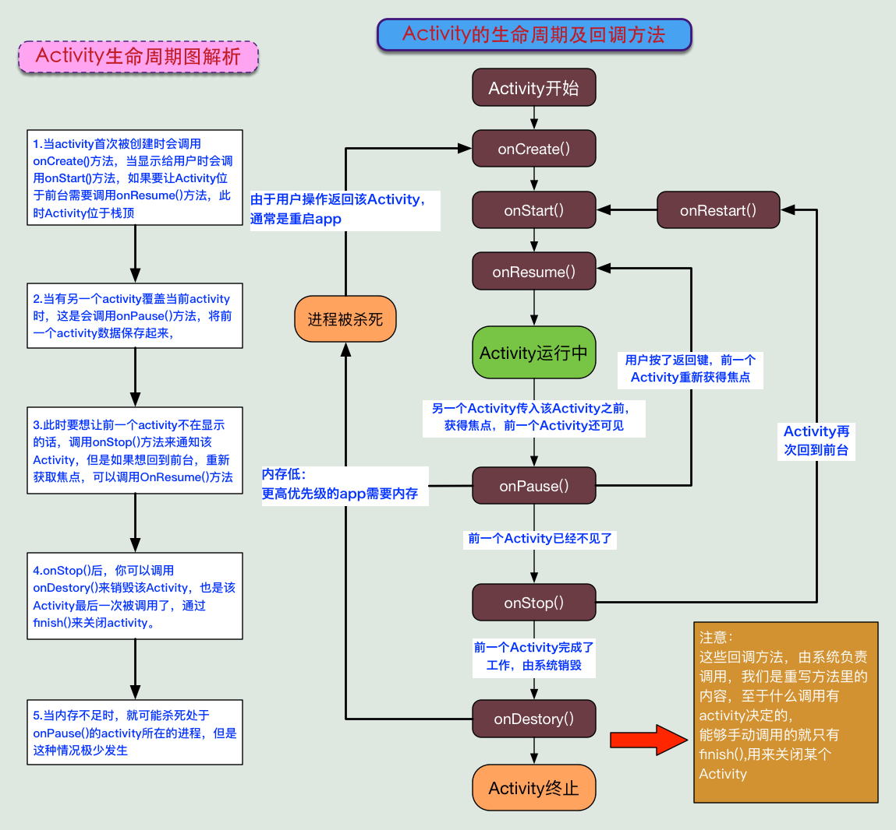
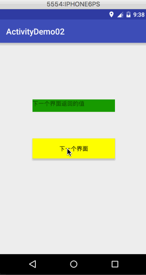

### 一步步学习四大组件之Activity

#### 1、介绍：
[官网文档](http://androiddoc.qiniudn.com/guide/components/activities.html)，其大意是：Activity是一个应用程序的组件，他在屏幕上提供了一个区域，允许用户在上面做一些交互性的操作， 比如打电话，照相，发送邮件，或者显示一个地图！Activity可以理解成一个绘制用户界面的窗口， 而这个窗口可以填满整个屏幕，也可能比屏幕小或者浮动在其他窗口的上方！

#### 2、生命周期



注意事项：

	1. onPause()和onStop()被调用的前提是： 打开了一个新的Activity！而前者是旧Activity还可见的状态；后者是旧Activity已经不可见！
	2. 另外，亲测：AlertDialog和PopWindow是不会触发上述两个回调方法的
	
#### 3、Activity、ActionBarActivity和AppCompatActivity的区别：
	
	ActionBarActivity已被废弃，从名字就知道，ActionBar~，而在5.0后，被Google弃用了，现在用 ToolBar...而我们现在在Android Studio创建一个Activity默认继承的会是：AppCompatActivity! 当然你也可以只写Activity，不过AppCompatActivity给我们提供了一些新的东西而已！ 两个选一个
	
#### 4、启动一个Activity的几种方式

第一种：显示启动：

a.最常见的方式,也是用的最多的:

	startActivity(new Intent(当前Act.this,要启动的Act.class));
b.通过Intent的ComponentName：
	
	ComponentName cn = new ComponentName("当前Act的全限定类名","启动Act的全限定类名") ;
	Intent intent = new Intent() ;
	intent.setComponent(cn) ;
	startActivity(intent) ;
c.初始化Intent时指定包名：

	Intent intent = new Intent("android.intent.action.MAIN");
	intent.setClassName("当前Act的全限定类名","启动Act的全限定类名");
	startActivity(intent);

第二种：隐式启动：**通过Intent-filter的Action,Category或data来实现 这个是通过Intent的 intent-filter来实现的**，使用自定义的Action与category来激活另一个Activity，在配置文件中配置第二个：

```java
<activity
    android:name=".SecondAcitvity">
    <intent-filter>
        <action android:name="my_action"/>
        <category android:name="my_category"/>
        <category android:name="android.intent.category.DEFAULT"/>
    </intent-filter>
</activity>
```
那么在第一个Activity启动SecondAcitvity就什么写：

```java
Intent it = new Intent();
it.setAction("my_action");
it.addCategory("my_category");
startActivity(it);
```

第三种：直接通过包名启动apk的：

```java
Intent intent = getPackageManager().getLaunchIntentForPackage
("apk第一个启动的Activity的全限定类名") ;
if(intent != null) startActivity(intent) ;
```

#### 5、横竖屏切换与状态保存的问题
App横竖屏切换的时候会销毁当前的Activity然后重新创建一个，如设一个按钮一个TextView点击按钮后，修改TextView 文本，然后横竖屏切换，会神奇的发现TextView文本变回之前的内容了！ 横竖屏切换时Act走下述生命周期：`onPause-> onStop-> onDestory-> onCreate->onStart->onResume`

a.如何禁止屏幕横竖屏自动切换，在AndroidManifest.xml中为Act添加一个属性：android:screenOrientation， 有下述可选值：

	unspecified:默认值 由系统来判断显示方向.判定的策略是和设备相关的，所以不同的设备会有不同的显示方向。
	landscape:横屏显示（宽比高要长）
	portrait:竖屏显示(高比宽要长)
	user:用户当前首选的方向
	behind:和该Activity下面的那个Activity的方向一致(在Activity堆栈中的)
	sensor:有物理的感应器来决定。如果用户旋转设备这屏幕会横竖屏切换。
	nosensor:忽略物理感应器，这样就不会随着用户旋转设备而更改了（"unspecified"设置除外）。
b.横竖屏时想加载不同的布局
首先，准备两套不同的布局，Android会自己根据横竖屏加载不同布局： 创建两个布局文件夹：layout-land横屏,layout-port竖屏 然后把这两套布局文件丢这两文件夹里，文件名一样，Android就会自行判断，然后加载相应布局了！
然后，在onCreate()方法中加载布局文件，对横竖屏的状态做下判断

```java

if (this.getResources().getConfiguration().orientation == Configuration.ORIENTATION_LANDSCAPE){  
     setContentView(R.layout.横屏);
}  

else if (this.getResources().getConfiguration().orientation ==Configuration.ORIENTATION_PORTRAIT) {  
    setContentView(R.layout.竖屏);
}
```

#### 6、系统提供的常见的Activity

```java
//拨打电话
 public void phoneCall(){
     Uri uri = Uri.parse("tel:10086");
     Intent intent = new Intent(Intent.ACTION_DIAL, uri);
     startActivity(intent);
 }

 //发送短信
 public void sendMsg(){
     // 给10086发送内容为“Hello”的短信
     Uri uri = Uri.parse("smsto:10086");
     Intent intent = new Intent(Intent.ACTION_SENDTO, uri);
     intent.putExtra("sms_body", "Hello");
     startActivity(intent);
 }

 //发送彩信（相当于发送带附件的短信）
 public void sendExtMsg(){
     Intent intent = new Intent(Intent.ACTION_SEND);
     intent.putExtra("sms_body", "Hello");
     Uri uri = Uri.parse("content://media/external/images/media/23");
     intent.putExtra(Intent.EXTRA_STREAM, uri);
     intent.setType("image/png");
     startActivity(intent);
 }

 //打开浏览器
 public void openBrowser(){
     // 打开Google主页
     Uri uri = Uri.parse("http://www.baidu.com");
     Intent intent  = new Intent(Intent.ACTION_VIEW, uri);
     startActivity(intent);
 }

 //多媒体播放
 public void openVideo(){
     Intent intent = new Intent(Intent.ACTION_VIEW);
     Uri uri = Uri.parse("file:///sdcard/foo.mp3");
     intent.setDataAndType(uri, "audio/mp3");
     startActivity(intent);
 }

 //获取SD卡下所有音频文件,然后播放第一首=-=
 public void playMusic(){
     Uri uri = Uri.withAppendedPath(MediaStore.Audio.Media.INTERNAL_CONTENT_URI, "1");
     Intent intent = new Intent(Intent.ACTION_VIEW, uri);
     startActivity(intent);
 }

 //打开摄像头拍照
 public void openCammar(){
     // 打开拍照程序
     Intent intent = new Intent(MediaStore.ACTION_IMAGE_CAPTURE);
     startActivityForResult(intent, 0);
     // 取出照片数据
     Bundle extras = intent.getExtras();
     Bitmap bitmap = (Bitmap) extras.get("data");
 }

 //调用系统相机应用程序，并存储拍下来的照片
 public void openCammar2(){
     Intent intent = new Intent(MediaStore.ACTION_IMAGE_CAPTURE);
    long time = Calendar.getInstance().getTimeInMillis();
     intent.putExtra(MediaStore.EXTRA_OUTPUT, Uri.fromFile(new File(Environment
             .getExternalStorageDirectory().getAbsolutePath()+"/tucue", time + ".jpg")));
     startActivityForResult(intent, ACTIVITY_GET_CAMERA_IMAGE);
 }

 //获取并剪切图片
 public void getClipImage(){
     Intent intent = new Intent(Intent.ACTION_GET_CONTENT);
     intent.setType("image/*");
     intent.putExtra("crop", "true"); // 开启剪切
     intent.putExtra("aspectX", 1); // 剪切的宽高比为1：2
     intent.putExtra("aspectY", 2);
     intent.putExtra("outputX", 20); // 保存图片的宽和高
     intent.putExtra("outputY", 40);
     intent.putExtra("output", Uri.fromFile(new File("/mnt/sdcard/temp"))); // 保存路径
     intent.putExtra("outputFormat", "JPEG");// 返回格式
     startActivityForResult(intent, 0);
 }

 public void getClipImage2(){
     // 剪切特定图片
     Intent intent = new Intent("com.android.camera.action.CROP");
     intent.setClassName("com.android.camera", "com.android.camera.CropImage");
     intent.setData(Uri.fromFile(new File("/mnt/sdcard/temp")));
     intent.putExtra("outputX", 1); // 剪切的宽高比为1：2
     intent.putExtra("outputY", 2);
     intent.putExtra("aspectX", 20); // 保存图片的宽和高
     intent.putExtra("aspectY", 40);
     intent.putExtra("scale", true);
     intent.putExtra("noFaceDetection", true);
     intent.putExtra("output", Uri.parse("file:///mnt/sdcard/temp"));
     startActivityForResult(intent, 0);
 }

 //进入手机设置界面
 public void openSystemSetting(){
     // 进入无线网络设置界面（其它可以举一反三）
     Intent intent = new Intent(android.provider.Settings.ACTION_WIRELESS_SETTINGS);
     startActivityForResult(intent, 0);
 }

 //安装apk
 public void installAPK（）{
     Uri installUri = Uri.fromParts("package", "xxx", null);
     Intent returnIt = new Intent(Intent.ACTION_PACKAGE_ADDED, installUri);
     startActivity(returnIt);
 }

 //卸载apk
 public void uninstallAPK(){
     Uri uri = Uri.fromParts("package", "包名", null);
     Intent it = new Intent(Intent.ACTION_DELETE, uri);
     startActivity(it);
 }

 public void openContact(){
     //16.进入联系人页面:
     Intent intent = new Intent();
     intent.setAction(Intent.ACTION_VIEW);
     intent.setData(People.CONTENT_URI);
     startActivity(intent);

     //17.查看指定联系人:
     /*
     Uri personUri = ContentUris.withAppendedId(People.CONTENT_URI, info.id);//info.id联系人ID
     Intent intent = new Intent();
     intent.setAction(Intent.ACTION_VIEW);
     intent.setData(personUri);
     startActivity(intent);*/
 }
```

#### 6、Activity间的数据传递

```java

public class MainActivity extends AppCompatActivity {

    private Button clicked;
    @Override
    protected void onCreate(Bundle savedInstanceState) {
        super.onCreate(savedInstanceState);
        setContentView(R.layout.activity_main);

        clicked = (Button) findViewById(R.id.button);
        clicked.setOnClickListener(new View.OnClickListener() {
            @Override
            public void onClick(View v) {

                // 一次传递单个数据
                Intent n1 = new Intent(MainActivity.this, MyAcitvity.class);
                n1.putExtra("key","你好啊！");
                startActivity(n1);

                // 一次传递多个数据
                Intent n2 = new Intent(MainActivity.this, MyAcitvity.class);
                Bundle bundle = new Bundle();
                bundle.putInt("number",1);
                bundle.putString("message","呵呵");
                n2.putExtras(bundle);
                startActivity(n2);
            }
        });
    }
}
```
#### 6、多个Activity间的交互(后一个传回给前一个)


实现步骤见项目[Demo](https://github.com/wangdongyang/AndroidEveryDay/tree/master/project/ActivityDemo02)

#### 7、Activity，Window与View的关系


#### 8、启动模式(launchMode)，
分别是：standard(默认)，singleTop，singleTask，singleInstance，如图：


参考资料：

- [Activity登堂入室](http://www.runoob.com/w3cnote/android-tutorial-activity-intro.html)
- [Activity启动模式图文详解：standard, singleTop, singleTask 以及 singleInstance](http://www.jcodecraeer.com/a/anzhuokaifa/androidkaifa/2015/0520/2897.html) - 泡在网上的日子
- [Android中Activity四种启动模式和taskAffinity属性详解](http://blog.csdn.net/zhangjg_blog/article/details/10923643)


