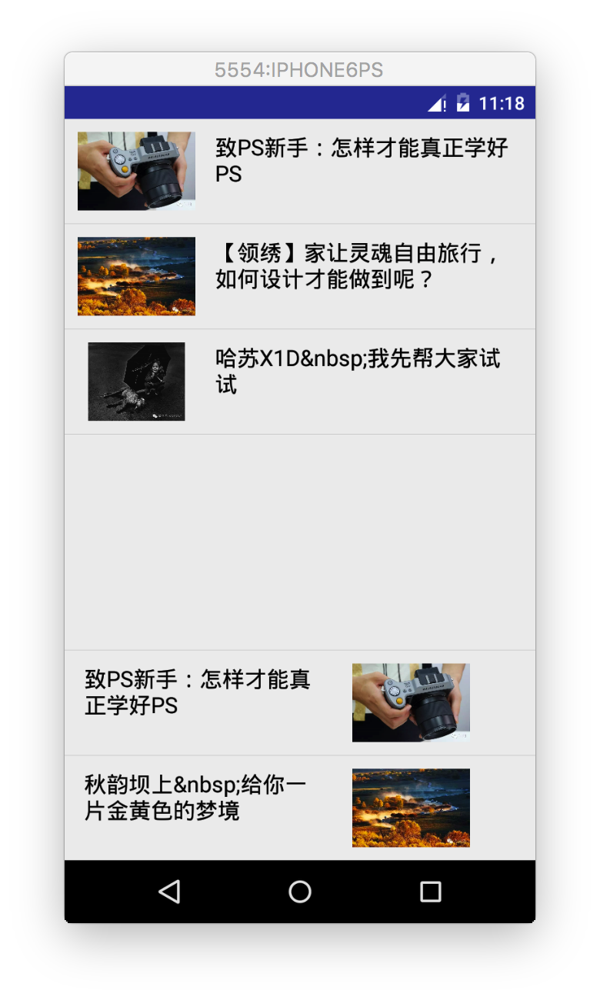

### 自己动手打造一个可复用BaseAdapter

上一个讲到ListView的一些基本使用和简单优化，如果频繁写BaseAdapter的实现，会造成大量冗余的代码，在实际项目开发中，我们需要自己来写一个自定义可复用的BaseAdapter，它不仅适用于ListView，还是适用于GridView等其他的Adapter控件，来看代码的实现：

#### 第一步，我们BaseAdapter抽成一个单独的类，

```java

/*
 * Created by wdy on 16/7/16.
 */
public class MyAdapter extends BaseAdapter {

    private Context mContext;
    private ArrayList<ArticleItem> mData;

    public MyAdapter(){

    }

    public MyAdapter(Context mContext, ArrayList<ArticleItem> mData){
        this.mContext = mContext;
        this.mData = mData;
    }

    @Override
    public int getCount() {
        return mData.size();
    }

    @Override
    public Object getItem(int position) {
        return null;
    }

    @Override
    public long getItemId(int position) {
        return 0;
    }

    @Override
    public View getView(int position, View convertView, ViewGroup parent) {
        ViewHolder holder = null;
        if (convertView == null){
            convertView = LayoutInflater.from(mContext).inflate(R.layout.item_list_article,parent,false);
            holder = new ViewHolder();
            holder.iconImage = (ImageView) convertView.findViewById(R.id.list_item_iv);
            holder.titleName = (TextView) convertView.findViewById(R.id.list_item_tv);
            convertView.setTag(holder);   //将Holder存储到convertView中
        }else{
            holder = (ViewHolder) convertView.getTag();
        }
        holder.iconImage.setBackgroundResource(mData.get(position).getImage());
        holder.titleName.setText(mData.get(position).getTitle());
        return convertView;
    }

    static class ViewHolder{
        ImageView iconImage;
        TextView titleName;
    }

    //添加一个元素
    public void add(ArticleItem data) {
        if (mData == null) {
            mData = new ArrayList<>();
        }
        mData.add(data);
        notifyDataSetChanged();
    }

    //往特定位置，添加一个元素
    public void add(int position,ArticleItem data){
        if (mData == null) {
            mData = new ArrayList<>();
        }
        mData.add(position, data);
        notifyDataSetChanged();
    }

    //删除一个元素
    public void remove(ArticleItem data) {
        if(mData != null) {
            mData.remove(data);
        }
        notifyDataSetChanged();
    }

    //删除指定位置元素
    public void remove(int position) {
        if(mData != null) {
            mData.remove(position);
        }
        notifyDataSetChanged();
    }

    //删除所有元素
    public void clear() {
        if(mData != null) {
            mData.clear();
        }
        notifyDataSetChanged();
    }
}
```

调用的就很简单，调用我们自定义的构造方法，将context和数据传过来即可

```java
lv.setAdapter(new MyAdapter(this, dataList));
```
#### 第二步，将Entity设置成泛型，
要打造成通用的BaseAdapter，就需要接受不同的数据，此时我们将接受的数据设置为泛型就可以达到目的。

```java
/**
 * Created by wdy on 16/7/16.
 */
public class MyAdapter<T> extends BaseAdapter {

    private Context mContext;
    private ArrayList<T> mData;

    public MyAdapter(){

    }

    public MyAdapter(Context mContext, ArrayList<T> mData){
        this.mContext = mContext;
        this.mData = mData;
    }

    @Override
    public int getCount() {
        return mData.size();
    }

    @Override
    public Object getItem(int position) {
        return null;
    }

    @Override
    public long getItemId(int position) {
        return 0;
    }

    @Override
    public View getView(int position, View convertView, ViewGroup parent) {
        ViewHolder holder = null;
        if (convertView == null){
            convertView = LayoutInflater.from(mContext).inflate(R.layout.item_list_article,parent,false);
            holder = new ViewHolder();
            holder.iconImage = (ImageView) convertView.findViewById(R.id.list_item_iv);
            holder.titleName = (TextView) convertView.findViewById(R.id.list_item_tv);
            convertView.setTag(holder);   //将Holder存储到convertView中
        }else{
            holder = (ViewHolder) convertView.getTag();
        }
        holder.iconImage.setBackgroundResource(mData.get(position).getImage());
        holder.titleName.setText(mData.get(position).getTitle());
        return convertView;
    }

    static class ViewHolder{
        ImageView iconImage;
        TextView titleName;
    }

    //添加一个元素
    public void add(T data) {
        if (mData == null) {
            mData = new ArrayList<>();
        }
        mData.add(data);
        notifyDataSetChanged();
    }

    //往特定位置，添加一个元素
    public void add(int position,T data){
        if (mData == null) {
            mData = new ArrayList<>();
        }
        mData.add(position, data);
        notifyDataSetChanged();
    }

    //删除一个元素
    public void remove(T data) {
        if(mData != null) {
            mData.remove(data);
        }
        notifyDataSetChanged();
    }

    //删除指定位置元素
    public void remove(int position) {
        if(mData != null) {
            mData.remove(position);
        }
        notifyDataSetChanged();
    }

    //删除所有元素
    public void clear() {
        if(mData != null) {
            mData.clear();
        }
        notifyDataSetChanged();
    }
}
```

#### 第三步：升级改造ViewHolder类

以上写完后，在`public View getView(int position, View convertView, ViewGroup parent){}`会报错，此时MyAdapter对外面还存在依赖，那么下一步，我们就需要来改造ViewHolder了，将getView()方法大部分的逻辑写到ViewHolder类里， 这个ViewHolder要做的事：

	定义一个查找控件的方法，我们的思路是通过暴露公共的方法，调用方法时传递过来 控件id，以及设置的内容，比如TextView设置文本： public ViewHolder setText(int id, CharSequence text){文本设置}
	将convertView复用部分搬到这里，那就需要传递一个context对象了，我们把需要获取 的部分都写到构造方法中！
	写一堆设置方法(public)，比如设置文字大小颜色，图片背景等！
	
ViewHolder改造后的代码：

```java
public static class ViewHolder{

        private SparseArray<View> mViews;   //存储ListView 的 item中的View
        private View item;                  //存放convertView
        private int position;               //游标
        private Context context;            //Context上下文
        ImageView iconImage;
        TextView titleName;

        //构造方法，完成相关初始化
        private ViewHolder(Context context, ViewGroup parent, int layoutRes) {
            mViews = new SparseArray<>();
            this.context = context;
            View convertView = LayoutInflater.from(context).inflate(layoutRes, parent,false);
            convertView.setTag(this);
            item = convertView;
        }

        //绑定ViewHolder与item
        public static ViewHolder bind(Context context, View convertView, ViewGroup parent,
                                      int layoutRes, int position) {
            ViewHolder holder;
            if(convertView == null) {
                //调用构造方法
                holder = new ViewHolder(context, parent, layoutRes);
            } else {
                holder = (ViewHolder) convertView.getTag();
                holder.item = convertView;
            }
            holder.position = position;
            return holder;
        }

        //根据id获取集合中保存的控件
        public <T extends View> T getView(int id) {
            T t = (T) mViews.get(id);
            if(t == null) {
                t = (T) item.findViewById(id);
                mViews.put(id, t);
            }
            return t;
        }

        /**
         * 获取当前条目
         */
        public View getItemView() {
            return item;
        }

        /**
         * 获取条目位置
         */
        public int getItemPosition() {
            return position;
        }

        /**
         * 设置文字
         */
        public ViewHolder setText(int id, CharSequence text) {
            View view = getView(id);
            if(view instanceof TextView) {
                ((TextView) view).setText(text);
            }
            return this;
        }

        /**
         * 设置图片
         */
        public ViewHolder setImageResource(int id, int drawableRes) {
            View view = getView(id);
            if(view instanceof ImageView) {
                ((ImageView) view).setImageResource(drawableRes);
            } else {
                view.setBackgroundResource(drawableRes);
            }
            return this;
        }


        /**
         * 设置点击监听
         */
        public ViewHolder setOnClickListener(int id, View.OnClickListener listener) {
            getView(id).setOnClickListener(listener);
            return this;
        }

        /**
         * 设置可见
         */
        public ViewHolder setVisibility(int id, int visible) {
            getView(id).setVisibility(visible);
            return this;
        }

        /**
         * 设置标签
         */
        public ViewHolder setTag(int id, Object obj) {
            getView(id).setTag(obj);
            return this;
        }

        //其他方法可自行扩展
    }
```
#### 第四步：定义一个抽象方法，完成ViewHolder与Data数据集的绑定
	
	public abstract void bindView(ViewHolder holder, T obj);
下面就是完整的MyAdpater类的实现：

```java
/**
 * Created by wdy on 16/7/16.
 */
public abstract class MyAdapter<T> extends BaseAdapter {

    private Context mContext;
    private ArrayList<T> mData;
    private int mLayoutRes;           //布局id

    public MyAdapter(){

    }
    public MyAdapter(ArrayList<T> mData, int mLayoutRes) {
        this.mData = mData;
        this.mLayoutRes = mLayoutRes;
    }

    @Override
    public int getCount() {
        return mData != null ? mData.size() : 0;
    }

    @Override
    public Object getItem(int position) {
        return mData.get(position);
    }

    @Override
    public long getItemId(int position) {
        return position;
    }

    @Override
    public View getView(int position, View convertView, ViewGroup parent) {
        ViewHolder holder = ViewHolder.bind(parent.getContext(), convertView, parent, mLayoutRes
                , position);
        bindView(holder, (T) getItem(position));
        return holder.getItemView();
    }

    public abstract void bindView(ViewHolder holder, T obj);

    //添加一个元素
    public void add(T data) {
        if (mData == null) {
            mData = new ArrayList<>();
        }
        mData.add(data);
        notifyDataSetChanged();
    }

    //往特定位置，添加一个元素
    public void add(int position,T data){
        if (mData == null) {
            mData = new ArrayList<>();
        }
        mData.add(position, data);
        notifyDataSetChanged();
    }

    //删除一个元素
    public void remove(T data) {
        if(mData != null) {
            mData.remove(data);
        }
        notifyDataSetChanged();
    }

    //删除指定位置元素
    public void remove(int position) {
        if(mData != null) {
            mData.remove(position);
        }
        notifyDataSetChanged();
    }

    //删除所有元素
    public void clear() {
        if(mData != null) {
            mData.clear();
        }
        notifyDataSetChanged();
    }

    public static class ViewHolder{

        private SparseArray<View> mViews;   //存储ListView 的 item中的View
        private View item;                  //存放convertView
        private int position;               //游标
        private Context context;            //Context上下文
        ImageView iconImage;
        TextView titleName;

        //构造方法，完成相关初始化
        private ViewHolder(Context context, ViewGroup parent, int layoutRes) {
            mViews = new SparseArray<>();
            this.context = context;
            View convertView = LayoutInflater.from(context).inflate(layoutRes, parent,false);
            convertView.setTag(this);
            item = convertView;
        }

        //绑定ViewHolder与item
        public static ViewHolder bind(Context context, View convertView, ViewGroup parent,
                                      int layoutRes, int position) {
            ViewHolder holder;
            if(convertView == null) {
                //调用构造方法
                holder = new ViewHolder(context, parent, layoutRes);
            } else {
                holder = (ViewHolder) convertView.getTag();
                holder.item = convertView;
            }
            holder.position = position;
            return holder;
        }

        //根据id获取集合中保存的控件
        public <T extends View> T getView(int id) {
            T t = (T) mViews.get(id);
            if(t == null) {
                t = (T) item.findViewById(id);
                mViews.put(id, t);
            }
            return t;
        }

        /**
         * 获取当前条目
         */
        public View getItemView() {
            return item;
        }

        /**
         * 获取条目位置
         */
        public int getItemPosition() {
            return position;
        }

        /**
         * 设置文字
         */
        public ViewHolder setText(int id, CharSequence text) {
            View view = getView(id);
            if(view instanceof TextView) {
                ((TextView) view).setText(text);
            }
            return this;
        }

        /**
         * 设置图片
         */
        public ViewHolder setImageResource(int id, int drawableRes) {
            View view = getView(id);
            if(view instanceof ImageView) {
                ((ImageView) view).setImageResource(drawableRes);
            } else {
                view.setBackgroundResource(drawableRes);
            }
            return this;
        }


        /**
         * 设置点击监听
         */
        public ViewHolder setOnClickListener(int id, View.OnClickListener listener) {
            getView(id).setOnClickListener(listener);
            return this;
        }

        /**
         * 设置可见
         */
        public ViewHolder setVisibility(int id, int visible) {
            getView(id).setVisibility(visible);
            return this;
        }

        /**
         * 设置标签
         */
        public ViewHolder setTag(int id, Object obj) {
            getView(id).setTag(obj);
            return this;
        }

        //其他方法可自行扩展
    }
}
```

在Activity里面调用：

```java
private ArrayList<ArticleItem> dataList = new ArrayList<ArticleItem>();
    private ArrayList<ArticleItem> dataList2 = new ArrayList<ArticleItem>();
    private ListView lv;
    private ListView lv2;
    @Override
    protected void onCreate(Bundle savedInstanceState) {
        super.onCreate(savedInstanceState);
        setContentView(R.layout.activity_main);

        dataList.add(new ArticleItem("致PS新手：怎样才能真正学好PS", R.drawable.imga01));
        dataList.add(new ArticleItem("【领绣】家让灵魂自由旅行，如何设计才能做到呢？", R.drawable.imga03));
        dataList.add(new ArticleItem("哈苏X1D&nbsp;我先帮大家试试", R.drawable.imga04));

        dataList2.add(new ArticleItem("致PS新手：怎样才能真正学好PS", R.drawable.imga01));
        dataList2.add(new ArticleItem("秋韵坝上&nbsp;给你一片金黄色的梦境", R.drawable.imga03));

        lv = (ListView)findViewById(R.id.lv);
        lv2 = (ListView)findViewById(R.id.lv2);

        MyAdapter adapter1 = new MyAdapter<ArticleItem>(dataList, R.layout.item_list_article) {
            @Override
            public void bindView(ViewHolder holder, ArticleItem obj) {
                holder.setImageResource(R.id.list_item_iv,obj.getImage());
                holder.setText(R.id.list_item_tv,obj.getTitle());
            }
        };


        MyAdapter adapter2 = new MyAdapter<ArticleItem>(dataList2, R.layout.item_list_article2) {
            @Override
            public void bindView(ViewHolder holder, ArticleItem obj) {
                holder.setImageResource(R.id.list_item_iv,obj.getImage());
                holder.setText(R.id.list_item_tv,obj.getTitle());
            }
        };

        lv.setAdapter(adapter1);
        lv2.setAdapter(adapter2);
    }
```

最终效果：


